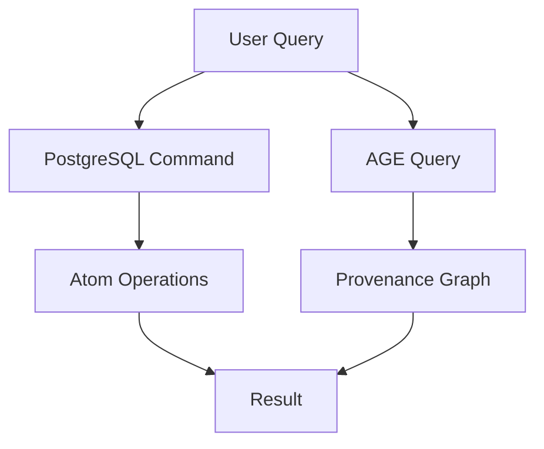
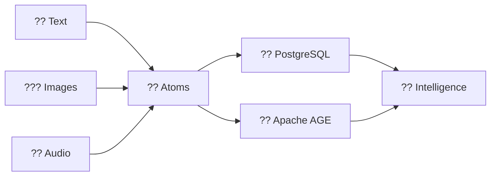
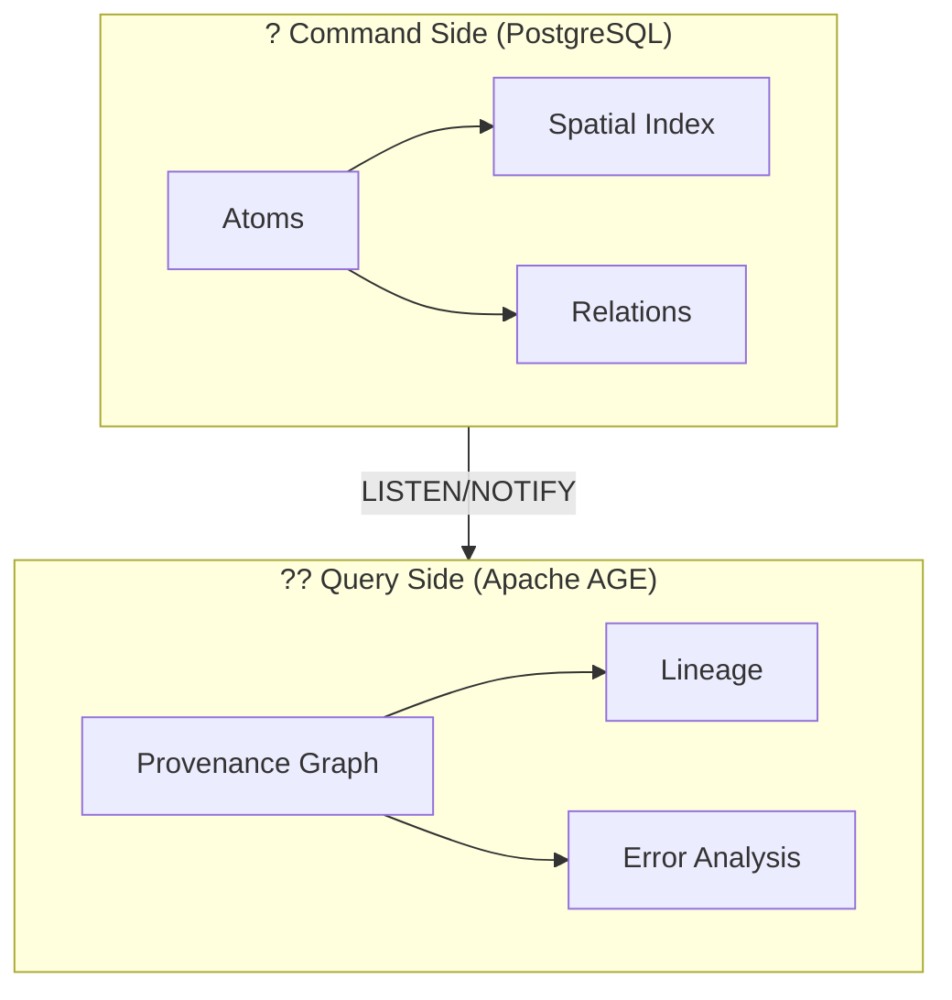

# ?? Enterprise Documentation Structure

**Proposed reorganization for enterprise-grade documentation**

---

## ?? Current State Issues

1. **Flat structure** - All docs in single `/docs` directory
2. **Mixed audiences** - Technical + business + internal notes mixed together
3. **No visual hierarchy** - No badges, diagrams, or GitHub features
4. **Hidden gems** - Important docs buried in flat list

---

## ??? Proposed Structure

```
Hartonomous/
??? README.md                      ? **MAIN ENTRY - Redesigned with badges, TOC, Mermaid**
?
??? .github/
?   ??? workflows/                 # GitHub Actions
?   ??? ISSUE_TEMPLATE/           # Issue templates
?   ??? PULL_REQUEST_TEMPLATE.md  # PR template
?   ??? FUNDING.yml               # Sponsor button
?
??? docs/
?   ??? README.md                 # Docs hub with visual navigation
?   ?
?   ??? ?? getting-started/       # **User-facing quickstart**
?   ?   ??? README.md
?   ?   ??? prerequisites.md
?   ?   ??? installation.md
?   ?   ??? first-query.md
?   ?   ??? examples.md
?   ?
?   ??? ??? architecture/          # **Technical deep dives**
?   ?   ??? README.md
?   ?   ??? cqrs-pattern.md       # PostgreSQL + AGE
?   ?   ??? vectorization.md      # SIMD/AVX strategies
?   ?   ??? cognitive-physics.md
?   ?   ??? diagrams/
?   ?       ??? cqrs-flow.mermaid
?   ?       ??? system-overview.mermaid
?   ?
?   ??? ?? ai-operations/         # **ML/AI functionality**
?   ?   ??? README.md
?   ?   ??? in-database-inference.md
?   ?   ??? training.md
?   ?   ??? model-export.md
?   ?   ??? gpu-acceleration.md
?   ?
?   ??? ?? api-reference/         # **API documentation**
?   ?   ??? README.md
?   ?   ??? atomization/
?   ?   ??? spatial/
?   ?   ??? inference/
?   ?   ??? provenance/
?   ?
?   ??? ?? deployment/            # **DevOps guides**
?   ?   ??? README.md
?   ?   ??? docker-compose.md
?   ?   ??? kubernetes.md
?   ?   ??? azure.md
?   ?   ??? monitoring.md
?   ?
?   ??? ?? business/              # **Stakeholder docs**
?   ?   ??? README.md
?   ?   ??? value-proposition.md
?   ?   ??? use-cases.md
?   ?   ??? roi-calculator.md
?   ?   ??? competitive-analysis.md
?   ?
?   ??? ?? research/              # **Internal research & notes**
?   ?   ??? README.md
?   ?   ??? python-stack-research.md
?   ?   ??? commit-messages/
?   ?   ?   ??? v0.5.0-commits.md
?   ?   ??? design-decisions/
?   ?   ??? experiments/
?   ?
?   ??? ?? vision/                # **Philosophy & roadmap**
?   ?   ??? README.md
?   ?   ??? project-vision.md
?   ?   ??? cognitive-substrate.md
?   ?   ??? roadmap.md
?   ?
?   ??? ??? contributing/         # **Contribution guides**
?       ??? README.md
?       ??? code-standards.md
?       ??? pull-request-process.md
?       ??? testing-guide.md
?       ??? audit-report.md
?
??? CHANGELOG.md                  # Version history
??? LICENSE                       # Copyright
??? SECURITY.md                   # Security policy
```

---

## ?? GitHub README Features to Implement

### 1. **Badges** (shields.io)
```markdown


```

### 2. **Table of Contents** (auto-generated anchors)
```markdown
## Table of Contents
- [Features](#features)
- [Quick Start](#quick-start)
- [Documentation](#documentation)
- [Architecture](#architecture)
```

### 3. **Mermaid Diagrams** (native GitHub support)


### 4. **Collapsible Sections**
```markdown
<details>
<summary>Click to expand detailed architecture</summary>

### CQRS Pattern
- PostgreSQL handles writes
- AGE handles provenance
- LISTEN/NOTIFY for sync

</details>
```

### 5. **Task Lists** (interactive checkboxes)
```markdown
## Implementation Status
- [x] Core schema
- [x] 80+ functions
- [x] CQRS pattern
- [ ] REST API
- [ ] GPU acceleration
```

### 6. **Syntax Highlighting**
```sql
-- PostgreSQL example
SELECT atomize_image_vectorized(pixels);
```

```python
# Python example
async with pool.connection() as conn:
    result = await conn.execute("SELECT * FROM atom")
```

### 7. **Emoji Support** ??
- ? Performance
- ?? AI Operations
- ?? Security
- ?? Metrics

### 8. **Anchor Links**
```markdown
Jump to [Architecture](#architecture-overview)
```

---

## ?? Migration Plan

### Phase 1: Restructure
1. Create new directory structure
2. Move existing docs to appropriate folders
3. Create README.md in each folder
4. Update all cross-references

### Phase 2: Enhance READMEs
1. Add badges to main README
2. Add Mermaid diagrams
3. Add table of contents
4. Add collapsible sections
5. Add task lists

### Phase 3: Separate Audiences
1. Move business docs to `/docs/business/`
2. Move research to `/docs/research/`
3. Move vision to `/docs/vision/`
4. Keep technical docs prominent

### Phase 4: GitHub Features
1. Add issue templates
2. Add PR template
3. Add GitHub Actions workflows
4. Add FUNDING.yml (sponsor button)
5. Add SECURITY.md

---

## ?? Mapping Current Docs to New Structure

| Current File | New Location | Visibility |
|--------------|--------------|------------|
| README.md | README.md | ? PUBLIC |
| SETUP.md | docs/getting-started/installation.md | ?? PUBLIC |
| docs/00-START-HERE.md | docs/getting-started/README.md | ?? PUBLIC |
| docs/03-GETTING-STARTED.md | docs/getting-started/first-query.md | ?? PUBLIC |
| docs/CQRS-ARCHITECTURE.md | docs/architecture/cqrs-pattern.md | ??? PUBLIC |
| docs/VECTORIZATION.md | docs/architecture/vectorization.md | ??? PUBLIC |
| docs/AI-OPERATIONS.md | docs/ai-operations/README.md | ?? PUBLIC |
| docs/10-API-REFERENCE.md | docs/api-reference/README.md | ?? PUBLIC |
| docs/11-DEPLOYMENT.md | docs/deployment/README.md | ?? PUBLIC |
| docs/12-BUSINESS.md | docs/business/value-proposition.md | ?? CENTER STAGE |
| BUSINESS-SUMMARY.md | docs/business/README.md | ?? CENTER STAGE |
| docs/PYTHON-APP-RESEARCH.md | docs/research/python-stack-research.md | ?? BASEMENT |
| DEVELOPMENT-ROADMAP.md | docs/vision/roadmap.md | ?? VISION |
| docs/01-VISION.md | docs/vision/project-vision.md | ?? VISION |
| AUDIT-REPORT.md | docs/contributing/audit-report.md | ??? CONTRIBUTING |
| CONTRIBUTING.md | docs/contributing/README.md | ??? CONTRIBUTING |

---

## ?? Enhanced README Preview

```markdown
<div align="center">

# ?? Hartonomous

**The First Self-Organizing Intelligence Substrate**

[](https://github.com/AHartTN/Hartonomous)
[](LICENSE)
[](https://www.postgresql.org/)
[](https://github.com/AHartTN/Hartonomous)

[**Get Started**](docs/getting-started/) · 
[**Documentation**](docs/) · 
[**Business Value**](docs/business/) · 
[**Roadmap**](docs/vision/roadmap.md)

</div>

---

## ? At a Glance



**Hartonomous** = Content-addressable substrate + In-database AI + Provenance graphs

---

## ?? Why Hartonomous?

<table>
<tr>
<td width="33%">

### ? Zero Latency
- No API calls
- No data movement
- Sub-millisecond operations

</td>
<td width="33%">

### ?? In-Database AI
- Training
- Inference
- Generation
- Export

</td>
<td width="33%">

### ?? Provenance
- 50-hop lineage in 10ms
- Poison atom detection
- Explainable AI

</td>
</tr>
</table>

---

## ?? Performance

<details>
<summary>?? Click to see benchmark results</summary>

| Operation | Before | After | Speedup |
|-----------|--------|-------|---------|
| Atomize 1M pixels | 5s | 50ms | **100x** |
| Train 1K samples | 5s | 50ms | **100x** |
| 50-hop lineage | 500ms | 10ms | **50x** |

</details>

---

## ?? Documentation

<div align="center">

| ?? [Getting Started](docs/getting-started/) | ??? [Architecture](docs/architecture/) | ?? [AI Operations](docs/ai-operations/) |
|:---:|:---:|:---:|
| Quick start guide | CQRS + Vectorization | In-database ML |

| ?? [API Reference](docs/api-reference/) | ?? [Deployment](docs/deployment/) | ?? [Business Value](docs/business/) |
|:---:|:---:|:---:|
| 80+ functions | Docker + K8s | ROI & use cases |

</div>

---

## ? Implementation Status

- [x] **Core Schema** - 3 tables, 18 indexes, 7 extensions
- [x] **80+ Functions** - Atomization, spatial, inference, provenance
- [x] **CQRS Pattern** - PostgreSQL + Apache AGE
- [x] **Vectorization** - 100x performance improvements
- [x] **Documentation** - Comprehensive guides
- [ ] **REST API** - FastAPI + psycopg3
- [ ] **GPU Acceleration** - CuPy integration
- [ ] **Production Deployment** - Docker + Kubernetes

---

## ??? Architecture



<details>
<summary>?? Read more about CQRS architecture</summary>

### Command Query Responsibility Segregation

- **PostgreSQL** = Fast writes, spatial operations
- **Apache AGE** = Deep lineage, provenance tracking
- **Async Sync** = Zero latency via LISTEN/NOTIFY

[Full architecture docs ?](docs/architecture/cqrs-pattern.md)

</details>

---

## ?? Quick Start

```bash
# Clone repository
git clone https://github.com/AHartTN/Hartonomous.git
cd Hartonomous

# Initialize database
cd scripts/setup
./init-database.sh  # or init-database.ps1 on Windows

# Run first query
psql -d hartonomous -c "SELECT atomize_pixel(255, 0, 0, 100, 50);"
```

[**Full installation guide ?**](docs/getting-started/installation.md)

---

## ?? License

**Copyright © 2025 Anthony Hart. All Rights Reserved.**

Proprietary and confidential. See [LICENSE](LICENSE) for details.

For licensing inquiries: aharttn@gmail.com

---

<div align="center">

**[? Back to Top](#-hartonomous)**

Made with ?? by [Anthony Hart](https://github.com/AHartTN)

</div>
```

---

## ?? Next Steps

1. **Review this proposal**
2. **Approve structure**
3. **Execute migration**
4. **Enhance READMEs with GitHub features**

---

**Status**: Proposal ready for approval
