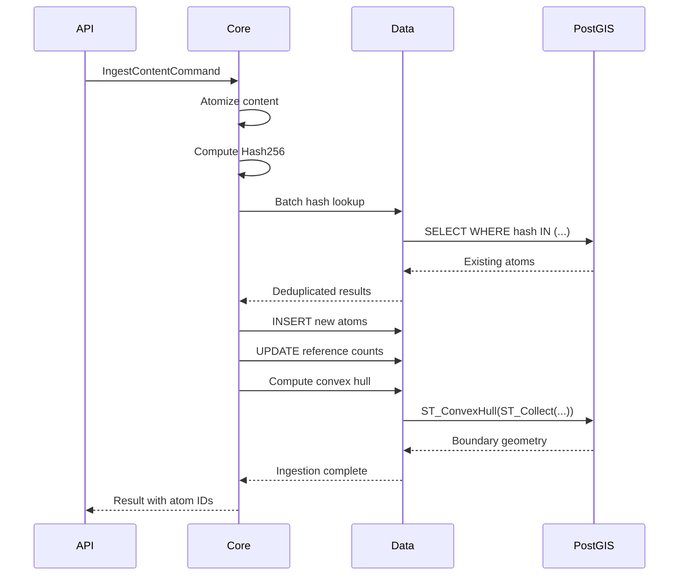
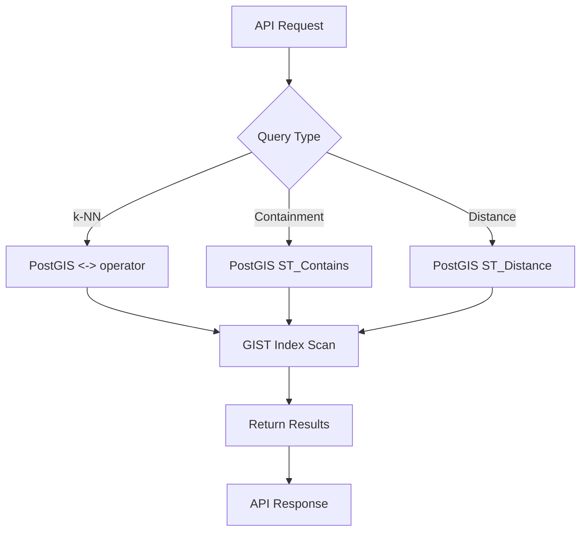

# Phase 7: Documentation & Training

## Table of Contents
- [Overview](#overview)
- [Phase Details](#phase-details)
- [Objectives](#objectives)
- [Implementation Tasks](#implementation-tasks)
  - [7.1: Technical Documentation](#71-technical-documentation)
  - [7.2: API Documentation](#72-api-documentation)
  - [7.3: Developer Guides](#73-developer-guides)
  - [7.4: Training Materials](#74-training-materials)
- [Success Criteria](#success-criteria)
- [Quality Gates](#quality-gates)
- [Risks & Mitigation](#risks--mitigation)
- [Dependencies](#dependencies)
- [Next Steps](#next-steps)

---

## Overview

**Phase 7** creates comprehensive documentation and training materials to enable developers, operators, and stakeholders to understand and use the Hartonomous geometric knowledge substrate effectively.

**Duration**: 2-3 days  
**Complexity**: Medium  
**Dependencies**: Phases 1-6  
**Prerequisites**: All features implemented and tested

---

## Phase Details

### Timeline
- **Start**: After Phase 6 completion
- **Duration**: 2-3 days
- **Parallelizable**: Documentation tasks can be distributed across team
- **Critical Path**: No - Can overlap with Phase 8

### Resource Requirements
- **Technical Writers**: 1-2 for documentation polish
- **Development Team**: SME input for technical accuracy
- **Tools**: Azure DevOps Wiki, Swagger/OpenAPI, Mermaid

---

## Objectives

1. **Complete Azure DevOps Wiki** - All sections fully documented
2. **Generate API documentation** - Swagger UI with examples
3. **Create developer onboarding guide** - New developers productive in <1 day
4. **Document deployment procedures** - Operations team can deploy independently
5. **Produce architecture diagrams** - Visual communication of POINTZM concepts

---

## Implementation Tasks

### 7.1: Technical Documentation

**Goal**: Comprehensive technical documentation in Azure DevOps Wiki.

<details>
<summary><strong>7.1.1: Complete Architecture Documentation</strong> (0.5 days)</summary>

**Verify and enhance existing wiki pages:**

- [x] **Home.md** - Landing page with navigation
- [x] **Getting-Started.md** - Onboarding guide
- [x] **Architecture/Overview.md** - POINTZM paradigm
- [x] **Architecture/Solution-Design.md** - Clean Architecture layers
- [x] **Architecture/Decision-Records.md** - ADR repository
- [ ] **Architecture/Data-Flow.md** - Data flow diagrams
- [ ] **Architecture/Security-Model.md** - Zero Trust implementation

**Add missing architecture sections:**

```markdown
# Architecture/Data-Flow.md

## Content Ingestion Flow



## Spatial Query Flow


```

</details>

<details>
<summary><strong>7.1.2: Database Schema Documentation</strong> (0.5 days)</summary>

**Create `Technical-Reference/Database-Schema.md`:**

```markdown
# Database Schema Reference

## Core Tables

### constants
Content-addressable atoms with POINTZM locations.

| Column | Type | Description |
|--------|------|-------------|
| id | uuid | Primary key |
| hash | bytea | SHA-256 content hash (32 bytes) |
| data | bytea | Raw content |
| location | geometry(POINTZM, 4326) | Spatial coordinates |
| reference_count | bigint | Deduplication counter |
| frequency | bigint | Usage frequency |
| created_at | timestamptz | Audit timestamp |

**Indexes:**
- `idx_constants_hash_btree` - B-tree on hash (deduplication lookup)
- `idx_constants_hilbert_btree` - B-tree on ST_X(location) (Hilbert ordering)
- `idx_constants_location_gist` - GIST on location (k-NN queries)

**Spatial Properties:**
- **X**: Hilbert index from Hash256
- **Y**: Shannon entropy [0, 2,097,151]
- **Z**: Kolmogorov complexity [0, 2,097,151]
- **M**: Graph connectivity [0, 2,097,151]

### bpe_tokens
Learned vocabulary patterns as LINESTRINGZM.

| Column | Type | Description |
|--------|------|-------------|
| id | uuid | Primary key |
| composition_geometry | geometry(LINESTRINGZM, 4326) | Path through atoms |
| constant_sequence | uuid[] | Ordered atom IDs |
| frequency | bigint | Pattern occurrence count |
| created_at | timestamptz | Discovery timestamp |

**Indexes:**
- `idx_bpe_tokens_composition_gist` - GIST on composition_geometry
- `idx_bpe_tokens_frequency` - B-tree on frequency (top patterns)

### embeddings
High-dimensional vectors as MULTIPOINTZM.

| Column | Type | Description |
|--------|------|-------------|
| id | uuid | Primary key |
| content_id | uuid | Source content reference |
| model_name | varchar(200) | Embedding model |
| dimensions | int | Vector dimensions |
| vector_geometry | geometry(MULTIPOINTZM, 4326) | 3D point chunks |

**Indexes:**
- `idx_embeddings_content_id` - B-tree on content_id
- `idx_embeddings_vector_gist` - GIST on vector_geometry (k-NN search)

## Spatial Functions

### Custom PL/pgSQL Functions

```sql
-- Compute Hilbert index from SHA-256 hash
CREATE FUNCTION hilbert_from_hash(hash bytea) RETURNS bigint AS $$
BEGIN
    -- Extract first 8 bytes, interpret as bigint
    RETURN (get_byte(hash, 0)::bigint << 56) |
           (get_byte(hash, 1)::bigint << 48) |
           (get_byte(hash, 2)::bigint << 40) |
           (get_byte(hash, 3)::bigint << 32) |
           (get_byte(hash, 4)::bigint << 24) |
           (get_byte(hash, 5)::bigint << 16) |
           (get_byte(hash, 6)::bigint << 8) |
           get_byte(hash, 7)::bigint;
END;
$$ LANGUAGE plpgsql IMMUTABLE;
```

### GPU-Accelerated PL/Python Functions

```sql
-- Compute Voronoi tessellation (GPU-accelerated)
CREATE FUNCTION voronoi_gpu(points geometry[]) RETURNS geometry AS $$
    import cupy as cp
    from scipy.spatial import Voronoi
    
    # Convert to GPU arrays
    coords = cp.array([[p.x, p.y, p.z] for p in points])
    
    # Compute Voronoi
    vor = Voronoi(coords.get())
    
    # Convert back to PostGIS geometry
    return construct_voronoi_geometry(vor)
$$ LANGUAGE plpython3u;
```

## Migration History

| Version | Date | Description |
|---------|------|-------------|
| 001 | 2025-01 | Initial schema with POINTZ |
| 002 | 2025-02 | Upgrade to POINTZM (add M dimension) |
| 003 | 2025-02 | Add BPE tokens table |
| 004 | 2025-03 | Add embeddings table |
| 005 | 2025-03 | Add spatial indexes |
```

</details>

---

### 7.2: API Documentation

**Goal**: Interactive API documentation with Swagger UI.

<details>
<summary><strong>7.2.1: Enhance Swagger Documentation</strong> (0.5 days)</summary>

**Update `Program.cs` with detailed Swagger configuration:**

```csharp
builder.Services.AddSwaggerGen(options =>
{
    options.SwaggerDoc("v1", new OpenApiInfo
    {
        Title = "Hartonomous API",
        Version = "v1",
        Description = @"
# Hartonomous Geometric Knowledge Substrate API

A universal geometric knowledge substrate using 4D POINTZM spatial coordinates 
for content-addressable storage with automatic deduplication.

## Key Features

- **Content-Addressable**: SHA-256 hashing with automatic deduplication
- **Geometric Encoding**: Everything stored as POINTZM (X=Hilbert, Y=Entropy, Z=Compressibility, M=Connectivity)
- **Spatial Queries**: PostGIS k-NN, containment, intersection queries
- **BPE Learning**: Automatic pattern discovery via Voronoi/Delaunay/MST

## Authentication

All endpoints require JWT Bearer token from Microsoft Entra ID.

```bash
curl -H 'Authorization: Bearer <token>' https://api.hartonomous.com/api/content
```
",
        Contact = new OpenApiContact
        {
            Name = "Hartonomous Team",
            Email = "dev@hartonomous.com"
        }
    });
    
    // Include XML comments
    var xmlFile = $"{Assembly.GetExecutingAssembly().GetName().Name}.xml";
    var xmlPath = Path.Combine(AppContext.BaseDirectory, xmlFile);
    options.IncludeXmlComments(xmlPath);
    
    // Add auth
    options.AddSecurityDefinition("Bearer", new OpenApiSecurityScheme
    {
        Description = "JWT Authorization header using Bearer scheme",
        Name = "Authorization",
        In = ParameterLocation.Header,
        Type = SecuritySchemeType.Http,
        Scheme = "bearer"
    });
    
    options.AddSecurityRequirement(new OpenApiSecurityRequirement
    {
        {
            new OpenApiSecurityScheme
            {
                Reference = new OpenApiReference
                {
                    Type = ReferenceType.SecurityScheme,
                    Id = "Bearer"
                }
            },
            Array.Empty<string>()
        }
    });
});
```

**Add XML documentation comments to controllers:**

```csharp
/// <summary>
/// Ingest content into the geometric knowledge substrate
/// </summary>
/// <param name="command">Content ingestion request</param>
/// <returns>Ingestion result with atom IDs and boundary geometry</returns>
/// <response code="200">Content ingested successfully</response>
/// <response code="400">Invalid content format</response>
/// <response code="401">Unauthorized - missing or invalid JWT</response>
/// <remarks>
/// Sample request:
///
///     POST /api/content/ingest
///     {
///         "content": "SGVsbG8gV29ybGQ=",  // Base64 encoded
///         "metadata": {
///             "source": "test.txt",
///             "contentType": "text/plain"
///         }
///     }
///
/// Sample response:
///
///     {
///         "id": "3fa85f64-5717-4562-b3fc-2c963f66afa6",
///         "atomIds": ["uuid1", "uuid2", "uuid3"],
///         "atomCount": 3,
///         "newAtomsCreated": 1,
///         "deduplicationRate": 0.666,
///         "boundaryGeometry": "POLYGON((...))"
///     }
/// </remarks>
[HttpPost("ingest")]
[ProducesResponseType(typeof(IngestionResult), StatusCodes.Status200OK)]
[ProducesResponseType(StatusCodes.Status400BadRequest)]
public async Task<ActionResult<IngestionResult>> IngestContent(
    [FromBody] IngestContentCommand command)
{
    // ...
}
```

</details>

<details>
<summary><strong>7.2.2: Create API Examples Collection</strong> (0.5 days)</summary>

**Create `Technical-Reference/API-Guide.md` with cURL examples:**

```markdown
# API Reference Guide

## Authentication

Get JWT token from Entra ID:

```bash
# Get token
TOKEN=$(curl -X POST "https://login.microsoftonline.com/$TENANT_ID/oauth2/v2.0/token" \
  -d "client_id=$CLIENT_ID" \
  -d "client_secret=$CLIENT_SECRET" \
  -d "scope=api://hartonomous/.default" \
  -d "grant_type=client_credentials" \
  | jq -r '.access_token')
```

## Content Ingestion

### Ingest Text Content

```bash
# Base64 encode content
CONTENT=$(echo "Hello World" | base64)

# Ingest
curl -X POST "https://api.hartonomous.com/api/content/ingest" \
  -H "Authorization: Bearer $TOKEN" \
  -H "Content-Type: application/json" \
  -d "{
    \"content\": \"$CONTENT\",
    \"metadata\": {
      \"source\": \"test.txt\"
    }
  }"
```

### Ingest File

```bash
# Ingest entire file
CONTENT=$(base64 < document.pdf)

curl -X POST "https://api.hartonomous.com/api/content/ingest" \
  -H "Authorization: Bearer $TOKEN" \
  -H "Content-Type: application/json" \
  -d "{
    \"content\": \"$CONTENT\",
    \"metadata\": {
      \"source\": \"document.pdf\",
      \"contentType\": \"application/pdf\"
    }
  }"
```

## Spatial Queries

### Find Similar Content (k-NN)

```bash
# Find 10 most similar atoms to target
curl "https://api.hartonomous.com/api/spatial/knn?targetId=uuid&k=10" \
  -H "Authorization: Bearer $TOKEN"
```

### Find Content Within Region

```bash
# Find atoms within geometric boundary
curl -X POST "https://api.hartonomous.com/api/spatial/contains" \
  -H "Authorization: Bearer $TOKEN" \
  -H "Content-Type: application/json" \
  -d "{
    \"boundary\": \"POLYGON((1000 500000, 2000 500000, 2000 600000, 1000 600000, 1000 500000))\"
  }"
```

### Search by Entropy/Compressibility

```bash
# Find atoms with high entropy (random/encrypted)
curl "https://api.hartonomous.com/api/spatial/search?minEntropy=1500000&maxEntropy=2097151" \
  -H "Authorization: Bearer $TOKEN"

# Find highly compressible atoms (repetitive)
curl "https://api.hartonomous.com/api/spatial/search?minCompressibility=1500000" \
  -H "Authorization: Bearer $TOKEN"
```

## BPE Vocabulary

### Get Learned Patterns

```bash
# Get top 100 most frequent patterns
curl "https://api.hartonomous.com/api/bpe/tokens?limit=100&orderBy=frequency" \
  -H "Authorization: Bearer $TOKEN"
```

### Trigger Vocabulary Learning

```bash
# Manually trigger BPE learning (admin only)
curl -X POST "https://api.hartonomous.com/api/bpe/learn" \
  -H "Authorization: Bearer $TOKEN" \
  -H "Content-Type: application/json" \
  -d "{
    \"minFrequency\": 100,
    \"maxVocabSize\": 10000
  }"
```
```

</details>

---

### 7.3: Developer Guides

**Goal**: Enable new developers to contribute within 1 day.

<details>
<summary><strong>7.3.1: Create Developer Onboarding Guide</strong> (0.5 days)</summary>

**Create `Developer-Guide.md`:**

```markdown
# Developer Guide

## Getting Started

### Prerequisites
- .NET 10 SDK
- PostgreSQL 14+ with PostGIS 3.3+
- Docker Desktop (for local development)
- Visual Studio 2025 or VS Code with C# extension

### First-Time Setup (15 minutes)

1. **Clone repository**
```bash
git clone https://github.com/AHartTN/Hartonomous.git
cd Hartonomous
```

2. **Start PostgreSQL**
```bash
docker run -d \
  --name hartonomous-postgres \
  -e POSTGRES_PASSWORD=dev \
  -e POSTGRES_DB=hartonomous \
  -p 5432:5432 \
  postgis/postgis:14-3.3
```

3. **Run migrations**
```bash
cd Hartonomous.Data
dotnet ef database update --startup-project ../Hartonomous.API
```

4. **Start API**
```bash
cd ../Hartonomous.API
dotnet run
```

5. **Verify setup**
```bash
curl http://localhost:5000/health
# Should return: "Healthy"
```

## Project Structure

```
Hartonomous/
├── Hartonomous.Core/          # Domain logic (CQRS, entities)
├── Hartonomous.Data/          # EF Core, repositories, PostGIS
├── Hartonomous.Infrastructure/# Cross-cutting (cache, quantization)
├── Hartonomous.API/           # REST API, controllers
├── Hartonomous.Worker/        # Background jobs (BPE learning)
└── Hartonomous.AppHost/       # .NET Aspire orchestration
```

## Coding Patterns

### Adding a New Entity

1. **Create entity in Core/Domain/Entities/**
```csharp
public sealed class MyEntity : BaseEntity, ISpatialEntity
{
    public Point Location { get; set; }
    // Properties...
    
    public static MyEntity Create(...)
    {
        // Factory method
    }
}
```

2. **Create EF configuration in Data/Configurations/**
```csharp
public sealed class MyEntityConfiguration : IEntityTypeConfiguration<MyEntity>
{
    public void Configure(EntityTypeBuilder<MyEntity> builder)
    {
        builder.ToTable("my_entities");
        builder.Property(e => e.Location)
            .HasColumnType("geometry(POINTZM, 4326)");
    }
}
```

3. **Add DbSet to ApplicationDbContext**
```csharp
public DbSet<MyEntity> MyEntities => Set<MyEntity>();
```

4. **Create migration**
```bash
dotnet ef migrations add AddMyEntity --startup-project Hartonomous.API
```

### Implementing CQRS Command

1. **Create command in Core/Application/Commands/**
```csharp
public sealed record CreateMyEntityCommand(string Data) 
    : IRequest<MyEntityDto>;
```

2. **Create handler**
```csharp
public sealed class CreateMyEntityHandler 
    : IRequestHandler<CreateMyEntityCommand, MyEntityDto>
{
    private readonly IRepository<MyEntity> _repository;
    private readonly IUnitOfWork _unitOfWork;
    
    public async Task<MyEntityDto> Handle(
        CreateMyEntityCommand request, 
        CancellationToken cancellationToken)
    {
        var entity = MyEntity.Create(request.Data);
        await _repository.AddAsync(entity, cancellationToken);
        await _unitOfWork.SaveChangesAsync(cancellationToken);
        return entity.ToDto();
    }
}
```

3. **Create controller endpoint**
```csharp
[HttpPost]
public async Task<ActionResult<MyEntityDto>> Create(
    [FromBody] CreateMyEntityCommand command)
{
    var result = await _mediator.Send(command);
    return CreatedAtAction(nameof(GetById), new { id = result.Id }, result);
}
```

### Spatial Queries

```csharp
// k-NN (nearest neighbors)
var nearest = await _dbContext.MyEntities
    .OrderBy(e => e.Location.Distance(targetPoint))
    .Take(10)
    .ToListAsync();

// Containment
var contained = await _dbContext.MyEntities
    .Where(e => boundary.Contains(e.Location))
    .ToListAsync();

// Range query (Hilbert order)
var range = await _dbContext.MyEntities
    .Where(e => e.Location.X >= start && e.Location.X <= end)
    .ToListAsync();
```

## Testing

### Running Tests
```bash
# All tests
dotnet test

# Specific project
dotnet test Hartonomous.Core.Tests

# With coverage
dotnet test --collect:"XPlat Code Coverage"
```

### Writing Unit Tests
```csharp
public sealed class MyEntityTests
{
    [Fact]
    public void Create_Should_Generate_Valid_POINTZM()
    {
        // Arrange
        var data = "test";
        
        // Act
        var entity = MyEntity.Create(data);
        
        // Assert
        entity.Location.Should().NotBeNull();
        entity.Location.SRID.Should().Be(4326);
    }
}
```

## Common Tasks

### Adding Spatial Index
```sql
CREATE INDEX CONCURRENTLY idx_my_entities_location_gist
    ON my_entities USING gist (location);
```

### Debugging Spatial Queries
```bash
# Use EXPLAIN ANALYZE to verify index usage
psql -d hartonomous -c "
EXPLAIN ANALYZE
SELECT * FROM constants
ORDER BY location <-> ST_MakePoint(1000, 500000, 1000000)::geometry
LIMIT 10;
"

# Should show: "Index Scan using idx_constants_location_gist"
```

### Viewing Aspire Dashboard
```bash
dotnet run --project Hartonomous.AppHost
# Opens dashboard at http://localhost:15xxx
```

## Best Practices

### ✅ DO
- Inherit `BaseEntity` for all entities
- Use `IUnitOfWork.SaveChangesAsync()` (never repository.SaveChanges)
- Specify SRID = 4326 for all geometries
- Write unit tests for domain logic
- Use factory methods (`Create()`) for entity construction

### ❌ DON'T
- Call `SaveChangesAsync()` on repositories
- Use SRID = 0 (non-geographic)
- Put business logic in controllers
- Skip migrations (always create migration for schema changes)
- Use `IgnoreQueryFilters()` without reason (soft delete bypass)
```

</details>

---

### 7.4: Training Materials

**Goal**: Stakeholder presentations and onboarding materials.

<details>
<summary><strong>7.4.1: Create Architecture Presentation</strong> (0.5 days)</summary>

**PowerPoint/PDF deck covering:**

1. **Problem Statement**
   - Traditional databases with spatial bolt-ons
   - Impedance mismatch between data model and storage

2. **Hartonomous Solution**
   - Everything IS geometry
   - POINTZM space encodes semantics
   - Deduplication via content-addressing

3. **Key Concepts**
   - Hilbert curves for spatial locality
   - Quantization (21-bit universal properties)
   - BPE with geometric boundaries

4. **Live Demo**
   - Ingest document
   - Show deduplication
   - Spatial queries
   - Voronoi visualization

5. **Benefits**
   - 99%+ deduplication after warm-up
   - Millisecond ingestion
   - Natural clustering without ML

</details>

---

## Success Criteria

- [ ] **Azure DevOps Wiki complete** - All planned sections finished
- [ ] **Swagger UI live** - API documentation accessible at /swagger
- [ ] **Developer onboarding <1 day** - New dev can submit PR in 1 day
- [ ] **Deployment runbook complete** - Ops can deploy without dev support
- [ ] **Architecture deck ready** - Stakeholder presentation prepared

---

## Quality Gates

### Documentation Review
- [ ] Technical accuracy verified by senior engineers
- [ ] Code examples tested and working
- [ ] All links valid (no 404s)
- [ ] Consistent formatting and terminology

### Completeness Check
- [ ] All API endpoints documented
- [ ] All database tables/columns described
- [ ] All configuration options explained
- [ ] Troubleshooting guide included

---

## Risks & Mitigation

| Risk | Impact | Probability | Mitigation |
|------|--------|-------------|------------|
| **Documentation becomes stale** | High | High | Automate docs generation, CI checks |
| **Examples stop working** | Medium | Medium | Automated testing of example code |
| **Missing tribal knowledge** | Medium | Medium | Knowledge transfer sessions, record decisions |

---

## Dependencies

### Upstream (Required)
- **Phases 1-6**: All features implemented and tested

### Downstream (Impacts)
- **Phase 8**: Deployment requires up-to-date runbooks
- **Ongoing**: Onboarding efficiency directly impacts team velocity

---

## Next Steps

After completing Phase 7:

1. **Proceed to Phase 8** - Production Hardening
2. **Schedule training sessions** - Walk team through new guides
3. **Publish documentation** - Make wiki accessible to stakeholders
4. **Gather feedback** - Iterate on unclear sections

**See**: [Phase 8: Production Hardening](Phase-8.md)

---

**Navigation**:  
← [Phase 6: Testing & QA](Phase-6.md) | [Master Plan](Master-Plan.md) | [Phase 8: Production Hardening](Phase-8.md) →
