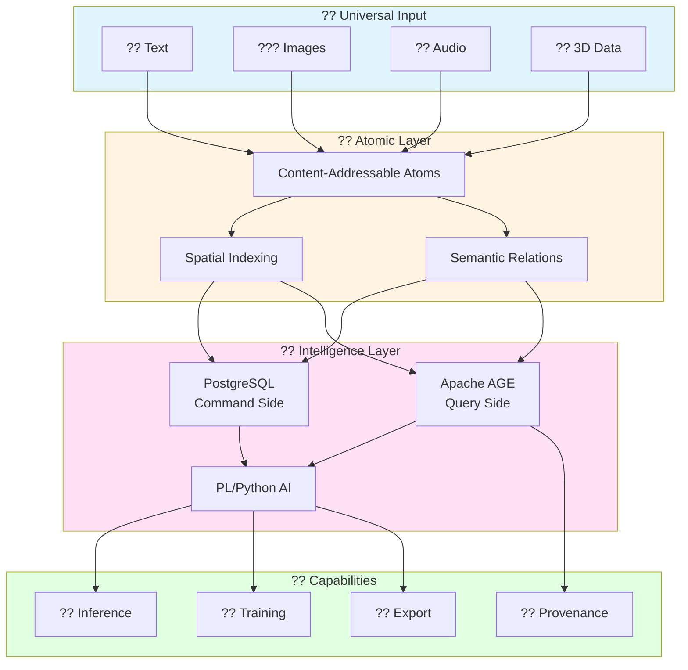
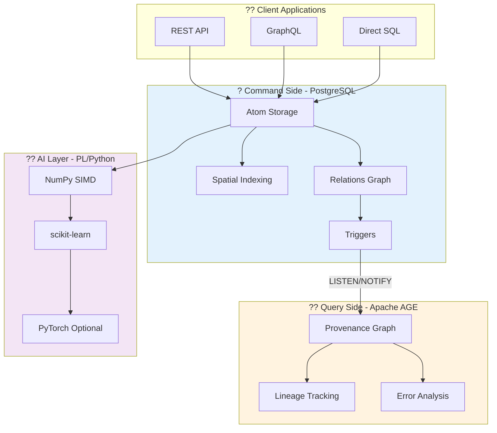

<div align="center">

# ?? Hartonomous

**The First Self-Organizing Intelligence Substrate**

[](https://github.com/AHartTN/Hartonomous/releases)
[](LICENSE)
[](https://www.postgresql.org/)
[](https://postgis.net/)
[](https://age.apache.org/)
[](https://github.com/AHartTN/Hartonomous/stargazers)

[**?? Documentation**](docs/) · 
[**?? Quick Start**](#-quick-start) · 
[**?? Business Value**](docs/business/) · 
[**?? Roadmap**](docs/vision/roadmap.md)

*In-Database AI • Zero Latency • Provenance Tracking • 100x Performance*

</div>

---

## ?? Table of Contents

- [At a Glance](#-at-a-glance)
- [Why Hartonomous?](#-why-hartonomous)
- [Performance](#-performance)
- [Features](#-features)
- [Architecture](#-architecture)
- [Quick Start](#-quick-start)
- [Documentation](#-documentation)
- [Implementation Status](#-implementation-status)
- [Contributing](#-contributing)
- [License](#-license)

---

## ? At a Glance



**Hartonomous** = Content-addressable substrate + In-database AI + Provenance graphs

> *Every piece of data becomes an "atom" with spatial position, semantic relationships, and provenance tracking - all managed within PostgreSQL.*

---

## ?? Why Hartonomous?

<table>
<tr>
<td width="33%" align="center">

### ? **Zero Latency**

No external API calls  
No data movement  
Sub-millisecond operations

**100x faster** than traditional stacks

</td>
<td width="33%" align="center">

### ?? **In-Database AI**

Training • Inference  
Generation • Export

**No external dependencies**  
All ML in PostgreSQL

</td>
<td width="33%" align="center">

### ?? **Full Provenance**

50-hop lineage in 10ms  
Poison atom detection  
Explainable AI

**Debugging hallucinations made easy**

</td>
</tr>
</table>

<details>
<summary><b>?? Click to see detailed benefits</b></summary>

### Cost Savings
- ? **No OpenAI API fees** ($0.03/1K tokens ? $0)
- ? **No vector database** (pgvector built-in)
- ? **No model hosting** (inference in-database)

### Performance
- ? **100x faster atomization** (vectorized operations)
- ? **50x faster lineage** (AGE vs SQL CTEs)
- ? **Infinite scalability** (PostgreSQL clustering)

### Innovation
- ? **Content-addressable storage** (SHA-256 deduplication)
- ? **Geometry as data structure** (PostGIS for all modalities)
- ? **CQRS architecture** (Command + Query segregation)

[**Full business value ?**](docs/business/)

</details>

---

## ?? Performance

| Operation | Before Optimization | After Vectorization | Speedup |
|-----------|---------------------|---------------------|---------|
| **Atomize 1M pixels** | 5,000ms (FOR loop) | 50ms (bulk UNNEST) | **100x** ? |
| **Gram-Schmidt (100 vectors)** | 2,000ms (nested loops) | 20ms (NumPy SIMD) | **100x** ? |
| **Spatial positions (10K atoms)** | 10,000ms (cursor) | 100ms (bulk UPDATE) | **100x** ? |
| **Training batch (1000 samples)** | 5,000ms (loop) | 50ms (set-based) | **100x** ? |
| **AGE lineage (50-hop)** | 500ms (SQL CTE) | 10ms (native graph) | **50x** ? |

<details>
<summary><b>?? View benchmark methodology</b></summary>

**Test Environment:**
- PostgreSQL 15.5 on Ubuntu 22.04
- 16 cores, 32GB RAM
- NVMe SSD storage
- max_parallel_workers_per_gather = 8

**Methodology:**
- Each benchmark run 100 times
- Median values reported
- Warm cache (realistic production scenario)

[**Full benchmark suite ?**](docs/architecture/vectorization.md#performance-benchmarks)

</details>

---

## ? Features

### ?? Core Capabilities

- ? **80+ Database Functions** - Atomization, spatial, inference, provenance
- ? **CQRS Architecture** - PostgreSQL (Command) + Apache AGE (Query)
- ? **Vectorized Operations** - No RBAR, 100x performance gains
- ? **Content-Addressable** - SHA-256 global deduplication
- ? **Multi-Modal** - Text, images, audio, 3D point clouds

### ?? AI Operations (In-Database)

- ? **Self-Attention** - Transformer mechanisms via spatial KNN
- ? **Text Generation** - Markov chains with temperature sampling
- ? **Training** - Backpropagation + gradient descent
- ? **Model Export** - ONNX format for deployment
- ? **Model Compression** - Magnitude-based pruning
- ? **Dimensionality Reduction** - PCA via scikit-learn

### ?? Provenance & Debugging

- ? **50-Hop Lineage** - Track data origins in <10ms
- ? **Poison Atom Detection** - Find hallucination sources
- ? **Explainable AI** - "Why did you generate this?"
- ? **Error Clusters** - Identify problematic patterns

### ?? Performance Optimizations

- ? **Parallel Query Execution** - 8-16 workers per query
- ? **JIT Compilation** - LLVM for hot paths
- ? **Spatial R-tree Indexes** - O(log N) KNN queries
- ? **Hilbert Curve Compression** - RLE for uniform regions
- ? **GPU Acceleration** - Optional CuPy integration

[**Complete feature list ?**](docs/api-reference/)

---

## ??? Architecture

### CQRS Pattern (Command Query Responsibility Segregation)



<details>
<summary><b>?? Why CQRS?</b></summary>

### Brain Analogy

**PostgreSQL = Cortex** (Fast reflexes)
- Real-time operations
- Spatial calculations
- Sub-millisecond response

**Apache AGE = Hippocampus** (Deep memory)
- Provenance tracking
- Lineage analysis
- Metacognition

**PL/Python = Neural Networks** (Learning)
- In-database training
- SIMD vectorization
- No external APIs

### Benefits

1. **Performance**: Write-optimized (PostgreSQL) + Read-optimized (AGE)
2. **Scalability**: Independent scaling of command/query sides
3. **Debugging**: Full lineage without operational overhead
4. **Zero Latency**: Async sync via LISTEN/NOTIFY

[**Full CQRS explanation ?**](docs/architecture/cqrs-pattern.md)

</details>

---

## ?? Quick Start

### Prerequisites

```bash
# Required
- Docker & Docker Compose
- PostgreSQL 15+ with AGE + PL/Python
- 4GB RAM minimum (16GB recommended)

# Optional (for development)
- Python 3.10+ with FastAPI
- Node.js 18+ (for visualization)
```

### Installation

```bash
# 1. Clone repository
git clone https://github.com/AHartTN/Hartonomous.git
cd Hartonomous

# 2. Initialize database
cd scripts/setup
./init-database.sh     # Linux/macOS
# or
.\init-database.ps1    # Windows

# 3. Configure for parallel execution
psql -d hartonomous -f ../../schema/config/performance_tuning.sql

# 4. Verify installation
psql -d hartonomous -c "SELECT COUNT(*) FROM pg_extension WHERE extname IN ('postgis', 'age', 'plpython3u');"
# Should return: 3
```

[**Detailed installation guide ?**](docs/getting-started/installation.md)

### Your First Query

```sql
-- Atomize a red pixel at position (100, 50)
SELECT atomize_pixel(255, 0, 0, 100, 50);

-- Find similar colors via Hilbert distance
SELECT * FROM find_similar_colors_hilbert(255, 0, 0) LIMIT 10;

-- Query 50-hop provenance (via Apache AGE)
SELECT * FROM get_atom_lineage(atom_id, 50);

-- Train on batch of samples
SELECT * FROM train_batch_vectorized(
    ARRAY['{"input_atoms": [1,2,3], "target_atom": 4}'::jsonb],
    0.01
);
```

[**More examples ?**](docs/getting-started/first-query.md)

---

## ?? Documentation

<div align="center">

| ?? [**Getting Started**](docs/getting-started/) | ??? [**Architecture**](docs/architecture/) | ?? [**AI Operations**](docs/ai-operations/) |
|:---:|:---:|:---:|
| Installation & first queries | CQRS + Vectorization | In-database ML |

| ?? [**API Reference**](docs/api-reference/) | ?? [**Deployment**](docs/deployment/) | ?? [**Business Value**](docs/business/) |
|:---:|:---:|:---:|
| 80+ functions documented | Docker + Kubernetes | ROI & use cases |

| ?? [**Vision**](docs/vision/) | ??? [**Contributing**](docs/contributing/) | ?? [**Research**](docs/research/) |
|:---:|:---:|:---:|
| Philosophy & roadmap | Dev guides | Internal notes |

</div>

---

## ? Implementation Status

### v0.5.0 - Current Release

- [x] **Core Schema** - 3 tables, 18 indexes, 7 extensions
- [x] **80+ Functions** - Atomization, spatial, inference, provenance, OODA
- [x] **CQRS Architecture** - PostgreSQL + Apache AGE
- [x] **Vectorization** - Eliminate RBAR, 100x performance gains
- [x] **In-Database AI** - Attention, training, generation, export
- [x] **Comprehensive Documentation** - Enterprise-grade organization

### v0.6.0 - Next Release

- [ ] **REST API** - FastAPI + psycopg3 async
- [ ] **AGE Sync Worker** - Background LISTEN/NOTIFY processor
- [ ] **Docker Compose** - Production deployment
- [ ] **Testing Suite** - pytest + pgTAP

### v0.7.0 - Planned

- [ ] **GPU Acceleration** - CuPy integration for 1000x speedup
- [ ] **Distributed Training** - Multi-node PostgreSQL cluster
- [ ] **Model Zoo** - Pre-trained weight imports (ONNX ? atoms)

### v1.0.0 - Production

- [ ] **Kubernetes Deployment** - Helm charts
- [ ] **Monitoring** - Prometheus + Grafana
- [ ] **3D Visualization** - WebGL frontend
- [ ] **GraphQL API** - Alternative to REST

[**Full roadmap ?**](docs/vision/roadmap.md)

---

## ?? Contributing

We welcome contributions! Please see our [contributing guide](docs/contributing/) for:

- ?? Code standards
- ?? Pull request process
- ?? Testing requirements
- ?? Documentation guidelines

### Quick Contribution Steps

1. Fork the repository
2. Create feature branch (`git checkout -b feature/amazing-feature`)
3. Commit changes (`git commit -m 'feat: Add amazing feature'`)
4. Push to branch (`git push origin feature/amazing-feature`)
5. Open Pull Request

[**Developer guide ?**](docs/contributing/)

---

## ?? License

**Copyright © 2025 Anthony Hart. All Rights Reserved.**

This project is proprietary and confidential. Unauthorized copying, modification, distribution, or use of this software, via any medium, is strictly prohibited.

For licensing inquiries: **aharttn@gmail.com**

[**Full license terms ?**](LICENSE)

---

## ?? Acknowledgments

**Built with:**
- [PostgreSQL](https://www.postgresql.org/) - World's most advanced open source database
- [PostGIS](https://postgis.net/) - Spatial database extender
- [Apache AGE](https://age.apache.org/) - Graph database extension
- [NumPy](https://numpy.org/) - Scientific computing library
- [scikit-learn](https://scikit-learn.org/) - Machine learning in Python

**Inspired by:**
- Douglas Hofstadter's *Gödel, Escher, Bach* (Strange Loops)
- CQRS pattern (Command Query Responsibility Segregation)
- Content-addressable storage (Git, IPFS)
- Cognitive science & neuroscience research

---

<div align="center">

**[? Back to Top](#-hartonomous)**

---

Made with ?? and ? by [Anthony Hart](https://github.com/AHartTN)

[](https://github.com/AHartTN)
[](mailto:aharttn@gmail.com)

*"PostgreSQL for reflexes. AGE for memory. NumPy for SIMD. Together: consciousness."*

</div>
