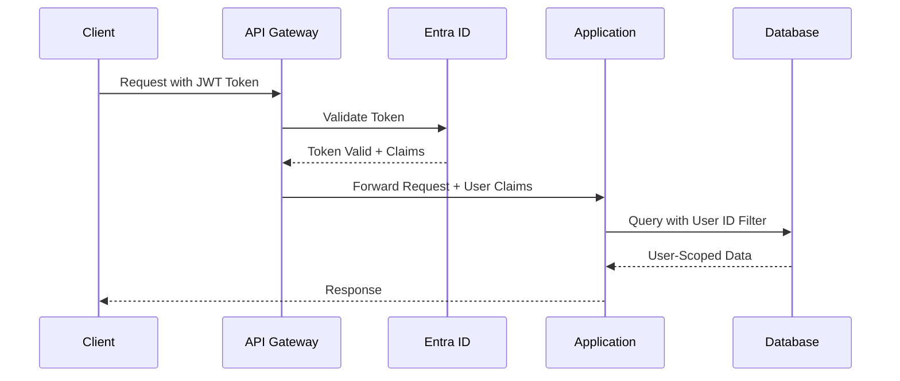

# Security Policy - Hartonomous AI Agent Factory Platform

**Copyright (c) 2024-2025 All Rights Reserved. This software is proprietary and confidential.**

## 🔐 Security Overview

The Hartonomous AI Agent Factory Platform implements enterprise-grade security measures to protect sensitive AI models, neural network parameters, and user data. This document outlines our comprehensive security architecture and policies.

## 🛡️ Security Architecture

### Multi-Layered Security Model

```
┌─────────────────────────────────────────────────────────────┐
│                    Security Layers                          │
├─────────────────────────────────────────────────────────────┤
│  Application Security                                       │
│  ┌─────────────┬─────────────┬─────────────┬─────────────┐  │
│  │ Input       │ Business    │ Output      │ Session     │  │
│  │ Validation  │ Logic       │ Encoding    │ Management  │  │
│  └─────────────┴─────────────┴─────────────┴─────────────┘  │
├─────────────────────────────────────────────────────────────┤
│  Identity & Access Management                              │
│  ┌─────────────┬─────────────┬─────────────┬─────────────┐  │
│  │ Microsoft   │   JWT       │    RBAC     │ Multi-Factor│  │
│  │ Entra ID    │  Tokens     │ Permissions │ Authentication│ │
│  └─────────────┴─────────────┴─────────────┴─────────────┘  │
├─────────────────────────────────────────────────────────────┤
│  Data Protection                                           │
│  ┌─────────────┬─────────────┬─────────────┬─────────────┐  │
│  │ Encryption  │Row-Level    │ Data        │ Backup      │  │
│  │ at Rest     │Security     │ Masking     │ Encryption  │  │
│  └─────────────┴─────────────┴─────────────┴─────────────┘  │
├─────────────────────────────────────────────────────────────┤
│  Network Security                                          │
│  ┌─────────────┬─────────────┬─────────────┬─────────────┐  │
│  │  TLS 1.3    │   Firewall  │    VPN      │   Network   │  │
│  │ Encryption  │   Rules     │  Access     │ Segmentation│  │
│  └─────────────┴─────────────┴─────────────┴─────────────┘  │
└─────────────────────────────────────────────────────────────┘
```

## 🔑 Identity & Access Management

### Microsoft Entra ID Integration
- **Enterprise SSO**: Single Sign-On with Microsoft Entra ID (Azure AD)
- **Conditional Access**: Location, device, and risk-based access policies
- **Privileged Identity Management**: Just-in-time administrative access
- **Identity Protection**: Real-time risk assessment and automated responses

### Authentication Flow


### JWT Token Claims
```json
{
  "oid": "user-object-id-for-data-scoping",
  "roles": ["AgentDeveloper", "ModelAnalyst"],
  "permissions": ["agents:create", "models:analyze"],
  "tenant": "organization-tenant-id",
  "exp": 1640995200,
  "iss": "https://login.microsoftonline.com/"
}
```

## 🏢 Multi-Tenant Security

### Data Isolation
- **Row-Level Security**: Every database query automatically filtered by User ID
- **Tenant Boundaries**: Logical separation of data by organization
- **Cross-Tenant Prevention**: Impossible to access another tenant's data
- **Audit Trails**: Complete logging of all cross-tenant boundary requests

### User ID Resolution
```csharp
// Automatic user scoping in all repository operations
public async Task<IEnumerable<Model>> GetModelsAsync(string userId)
{
    return await _context.Models
        .Where(m => m.UserId == userId)  // Enforced automatically
        .ToListAsync();
}
```

## 🔒 Data Protection

### Encryption Standards

#### Data at Rest
- **SQL Server TDE**: Transparent Data Encryption for database files
- **Azure Key Vault**: HSM-backed key management
- **Column-Level Encryption**: Sensitive fields encrypted individually
- **Always Encrypted**: Client-side encryption for critical data

#### Data in Transit
- **TLS 1.3**: All communications encrypted with latest TLS standard
- **Certificate Pinning**: Prevention of man-in-the-middle attacks
- **HSTS Headers**: HTTP Strict Transport Security enforcement
- **Perfect Forward Secrecy**: Each session uses unique encryption keys

### Sensitive Data Classification

| Data Type | Classification | Protection |
|-----------|----------------|------------|
| **AI Model Parameters** | Top Secret | Always Encrypted + HSM |
| **Neural Activations** | Confidential | TDE + Access Logging |
| **User Credentials** | Restricted | Azure Key Vault + MFA |
| **Business Logic** | Internal | TDE + Role-Based Access |
| **Metadata** | Internal | TDE + Audit Logging |

## 🧠 AI Model Security

### Model Protection
- **Parameter Encryption**: All model weights encrypted at rest
- **Access Logging**: Every model access attempt logged
- **Version Control**: Cryptographic hashing of model versions
- **Integrity Verification**: Tamper detection for model parameters

### Constitutional AI Security
```csharp
// Example safety constraint enforcement
public class ModelSecurityConstraint : IConstitutionalRule
{
    public async Task<ValidationResult> ValidateAsync(AgentInteraction interaction)
    {
        // Prevent extraction of model parameters
        if (interaction.ContainsParameterExtraction())
        {
            return ValidationResult.Violation("Parameter extraction blocked");
        }

        // Prevent reverse engineering attempts
        if (interaction.ContainsReverseEngineeringPatterns())
        {
            return ValidationResult.Violation("Reverse engineering blocked");
        }

        return ValidationResult.Success;
    }
}
```

### Mechanistic Interpretability Security
- **Circuit Protection**: Neural circuit analysis results protected as trade secrets
- **Feature Obfuscation**: Sensitive feature patterns masked in responses
- **Analysis Limiting**: Rate limiting on interpretability queries
- **Intellectual Property Protection**: Algorithm implementations protected

## 🌐 Network Security

### Infrastructure Protection
- **WAF (Web Application Firewall)**: Protection against OWASP Top 10
- **DDoS Protection**: Distributed denial of service mitigation
- **IP Allowlisting**: Restricted access to administrative interfaces
- **Network Segmentation**: Isolated network zones for different components

### API Security
```csharp
[Authorize(Roles = "AgentDeveloper")]
[RateLimit("10 per minute")]
[ValidateAntiForgeryToken]
public async Task<IActionResult> CreateAgent([FromBody] AgentCreationRequest request)
{
    // Input validation
    if (!ModelState.IsValid)
        return BadRequest(ModelState);

    // Authorization check
    if (!await _authService.CanCreateAgent(User.GetUserId()))
        return Forbid();

    // Business logic with security logging
    var result = await _agentService.CreateAgentAsync(request, User.GetUserId());

    _logger.LogSecurityEvent("AgentCreated", new { UserId = User.GetUserId(), AgentId = result.Id });

    return Ok(result);
}
```

### Rate Limiting & Throttling

| Endpoint Category | Rate Limit | Burst Limit | Window |
|------------------|------------|-------------|---------|
| **Authentication** | 5/min | 10 | 1 hour |
| **Agent Creation** | 10/min | 20 | 1 hour |
| **Model Queries** | 100/min | 200 | 15 minutes |
| **Data Export** | 1/min | 3 | 24 hours |
| **Administrative** | 2/min | 5 | 1 hour |

## 🔍 Security Monitoring & Incident Response

### Security Information and Event Management (SIEM)
- **Azure Sentinel**: Cloud-native SIEM for threat detection
- **Custom Detection Rules**: AI-specific threat patterns
- **Automated Response**: Immediate threat containment
- **Forensic Capabilities**: Complete audit trail preservation

### Monitoring Alerts

#### High-Severity Alerts
- Unauthorized model parameter access attempts
- Multiple failed authentication attempts
- Unusual data export patterns
- SQL injection or XSS attempts
- Privilege escalation attempts

#### Security Metrics
```csharp
public class SecurityMetrics
{
    [Counter]
    public static readonly Counter AuthenticationFailures =
        Metrics.CreateCounter("auth_failures_total", "Total authentication failures");

    [Counter]
    public static readonly Counter ModelAccessAttempts =
        Metrics.CreateCounter("model_access_total", "Total model access attempts");

    [Histogram]
    public static readonly Histogram SecurityEventProcessingTime =
        Metrics.CreateHistogram("security_event_processing_seconds", "Security event processing time");
}
```

### Incident Response Plan

#### Phase 1: Detection & Analysis (0-1 hour)
1. **Automated Detection**: SIEM alerts security team
2. **Initial Assessment**: Determine severity and scope
3. **Containment Decision**: Immediate actions to limit damage
4. **Stakeholder Notification**: Alert relevant teams and management

#### Phase 2: Containment & Eradication (1-4 hours)
1. **System Isolation**: Isolate affected systems
2. **Threat Removal**: Remove malicious code or unauthorized access
3. **Vulnerability Patching**: Address security gaps
4. **Evidence Preservation**: Maintain forensic integrity

#### Phase 3: Recovery & Monitoring (4-24 hours)
1. **System Restoration**: Bring systems back online safely
2. **Enhanced Monitoring**: Increased surveillance for related threats
3. **Validation Testing**: Ensure systems are secure and functional
4. **Documentation**: Complete incident report

## 📋 Compliance & Auditing

### Regulatory Compliance
- **SOC 2 Type II**: Annual security and availability audits
- **ISO 27001**: Information security management certification
- **GDPR**: EU data protection regulation compliance
- **CCPA**: California consumer privacy act compliance
- **PIPEDA**: Personal Information Protection and Electronic Documents Act

### Audit Logging
```csharp
public class SecurityAuditLog
{
    public Guid EventId { get; set; }
    public string UserId { get; set; }
    public string EventType { get; set; }  // Authentication, DataAccess, ModelQuery, etc.
    public string Resource { get; set; }    // Specific resource accessed
    public string Action { get; set; }      // Create, Read, Update, Delete
    public bool Success { get; set; }
    public string IpAddress { get; set; }
    public string UserAgent { get; set; }
    public Dictionary<string, object> Metadata { get; set; }
    public DateTime Timestamp { get; set; }
}
```

### Data Retention Policies
| Data Type | Retention Period | Storage Location | Access Control |
|-----------|------------------|------------------|----------------|
| **Security Logs** | 7 years | Immutable storage | Security team only |
| **Audit Trails** | 7 years | Encrypted archive | Compliance team |
| **Model Parameters** | Indefinite | Encrypted database | Model owners |
| **User Data** | Per user request | Standard database | Data owners |
| **Backup Data** | 3 years | Encrypted backup | System administrators |

## 🔒 Development Security

### Secure Development Lifecycle (SDL)

#### Design Phase
- **Threat Modeling**: Systematic identification of security risks
- **Security Architecture Review**: Independent security assessment
- **Privacy Impact Assessment**: Data protection evaluation

#### Implementation Phase
- **Static Code Analysis**: Automated vulnerability scanning
- **Dependency Scanning**: Third-party library security assessment
- **Security Code Review**: Manual review of critical components

#### Testing Phase
- **Penetration Testing**: Simulated attacks by security experts
- **Security Regression Testing**: Automated security test suite
- **Fuzz Testing**: Input validation and error handling verification

#### Deployment Phase
- **Security Configuration**: Hardened deployment configurations
- **Secrets Management**: Automated secret rotation and protection
- **Runtime Security**: Application security monitoring

### Code Security Standards
```csharp
// Example of secure coding practices
public class SecureDataAccess
{
    private readonly string _connectionString;
    private readonly ILogger<SecureDataAccess> _logger;

    public async Task<Model> GetModelAsync(Guid modelId, string userId)
    {
        // Input validation
        if (modelId == Guid.Empty)
            throw new ArgumentException("Invalid model ID", nameof(modelId));

        if (string.IsNullOrWhiteSpace(userId))
            throw new ArgumentException("User ID required", nameof(userId));

        // Parameterized query to prevent SQL injection
        using var connection = new SqlConnection(_connectionString);
        using var command = new SqlCommand(
            "SELECT * FROM Models WHERE ModelId = @ModelId AND UserId = @UserId",
            connection);

        command.Parameters.AddWithValue("@ModelId", modelId);
        command.Parameters.AddWithValue("@UserId", userId);

        // Security logging
        _logger.LogInformation("Model access attempt: {ModelId} by {UserId}", modelId, userId);

        // Execute with timeout
        command.CommandTimeout = 30;

        await connection.OpenAsync();
        using var reader = await command.ExecuteReaderAsync();

        if (await reader.ReadAsync())
        {
            _logger.LogInformation("Model access granted: {ModelId} by {UserId}", modelId, userId);
            return MapToModel(reader);
        }

        _logger.LogWarning("Model access denied: {ModelId} by {UserId}", modelId, userId);
        return null;
    }
}
```

## 🚨 Security Incident Reporting

### Internal Reporting
- **Security Email**: security@hartonomous.com
- **Emergency Hotline**: Available 24/7 for critical incidents
- **Incident Portal**: Web-based reporting system for non-critical issues
- **Anonymous Reporting**: Option for anonymous security concerns

### External Reporting
- **Responsible Disclosure**: Coordinated vulnerability disclosure program
- **Bug Bounty**: Rewards for security vulnerability discoveries
- **Regulatory Reporting**: Mandatory breach notifications to authorities
- **Customer Notification**: Transparent communication about security incidents

### Severity Classification

#### Critical (P0) - 15 minutes
- Active data breach or unauthorized access
- System compromise or ransomware
- Public exposure of sensitive data
- Complete service outage due to security incident

#### High (P1) - 1 hour
- Privilege escalation vulnerabilities
- SQL injection or XSS vulnerabilities
- Authentication bypass
- Significant data exposure risk

#### Medium (P2) - 8 hours
- Information disclosure vulnerabilities
- Minor privilege escalation
- Denial of service vulnerabilities
- Security configuration issues

#### Low (P3) - 24 hours
- Security best practice violations
- Minor information leakage
- Non-exploitable vulnerabilities
- Security enhancement recommendations

## 📞 Security Contacts

### Security Team
- **Chief Security Officer**: cso@hartonomous.com
- **Security Operations**: secops@hartonomous.com
- **Incident Response**: incident-response@hartonomous.com
- **Compliance**: compliance@hartonomous.com

### Emergency Contacts
- **24/7 Security Hotline**: +1-XXX-XXX-XXXX
- **Emergency Response**: emergency@hartonomous.com
- **Executive Escalation**: executives@hartonomous.com

---

**Last Updated**: December 2024
**Document Version**: 1.0
**Classification**: Internal Use Only

This security policy is reviewed quarterly and updated as needed to address emerging threats and regulatory changes.