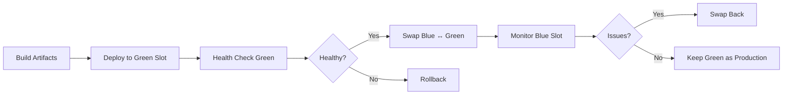

# Deployment Guide

## Table of Contents
- [Overview](#overview)
- [Prerequisites](#prerequisites)
- [Local Development](#local-development)
- [Staging Deployment](#staging-deployment)
- [Production Deployment](#production-deployment)
- [Azure Arc Integration](#azure-arc-integration)
- [Database Deployment](#database-deployment)
- [Monitoring & Health Checks](#monitoring--health-checks)
- [Rollback Procedures](#rollback-procedures)
- [Troubleshooting](#troubleshooting)

---

## Overview

Hartonomous uses a **blue-green deployment** strategy via **Azure Arc** for zero-downtime releases to on-premises infrastructure.

**Deployment Architecture**:
- **Development**: Local machines (Windows/Linux/macOS)
- **Staging**: `hart-server` (staging slot) - Production-like environment for validation
- **Production**: `hart-server` (production slot) - Live production environment

**CI/CD Pipeline**: Azure DevOps Pipelines orchestrate build, test, package, and deploy stages.

---

## Prerequisites

### Required Tools

| Tool | Version | Purpose |
|------|---------|---------|
| .NET SDK | 10.0+ | Build and run application |
| PostgreSQL | 14.0+ | Database server |
| PostGIS | 3.3+ | Spatial extensions |
| Docker Desktop | 24.0+ | Container orchestration (optional for local) |
| Azure CLI | 2.50+ | Azure Arc management |
| Git | 2.40+ | Source control |

### Azure Services

- **Azure DevOps**: CI/CD pipelines
- **Azure Arc**: On-premises server management
- **Azure Key Vault**: Secrets management
- **Azure Blob Storage**: Backup storage
- **Application Insights**: Monitoring and telemetry

### Required Access

```bash
# Azure CLI login
az login

# Verify Arc connectivity
az connectedmachine show \
  --name hart-server \
  --resource-group hartonomous-prod

# Test Key Vault access
az keyvault secret show \
  --vault-name hartonomous-kv \
  --name PostgreSqlConnectionString
```

---

## Local Development

### Using .NET Aspire (Recommended)

```powershell
# Clone repository
git clone https://dev.azure.com/hartonomous/Hartonomous/_git/Hartonomous
cd Hartonomous

# Start all services with Aspire
dotnet run --project Hartonomous.AppHost
```

Aspire Dashboard opens at `http://localhost:15xxx` showing:
- All running services
- Structured logs
- Distributed traces
- Metrics dashboards
- Service endpoints

### Manual Local Setup

```powershell
# Start PostgreSQL (Docker)
docker run -d `
  --name hartonomous-postgres `
  -e POSTGRES_PASSWORD=dev_password `
  -e POSTGRES_DB=hartonomous `
  -p 5432:5432 `
  postgis/postgis:14-3.3

# Apply migrations
cd Hartonomous.Data
dotnet ef database update --startup-project ../Hartonomous.API

# Run API
cd ../Hartonomous.API
dotnet run

# Run Worker (separate terminal)
cd ../Hartonomous.Worker
dotnet run
```

### Environment Variables (Local)

Create `appsettings.Local.json` (not committed to source control):

```json
{
  "ConnectionStrings": {
    "PostgreSqlConnection": "Host=localhost;Port=5432;Database=hartonomous;Username=postgres;Password=dev_password"
  },
  "AzureAd": {
    "Instance": "https://login.microsoftonline.com/",
    "TenantId": "your-dev-tenant-id",
    "ClientId": "your-dev-client-id"
  },
  "Redis": {
    "ConnectionString": "localhost:6379"
  }
}
```

---

## Staging Deployment

Staging mimics production for final validation before release.

### Automatic Deployment (CI/CD)

Triggered on merge to `staging` branch:

```yaml
# azure-pipelines.yml excerpt
trigger:
  branches:
    include:
      - staging

stages:
  - stage: DeployStaging
    jobs:
      - job: Deploy
        steps:
          - task: AzureArcRunCommand@1
            inputs:
              azureSubscription: 'Hartonomous-Prod'
              resourceGroup: 'hartonomous-prod'
              machineName: 'hart-server'
              scriptType: 'bash'
              scriptLocation: 'scriptPath'
              scriptPath: 'deploy/deploy-staging.sh'
```

### Manual Staging Deployment

```powershell
# Build artifacts
dotnet publish Hartonomous.API/Hartonomous.Api.csproj `
  -c Staging `
  -o artifacts/publish/api-staging `
  --no-self-contained

dotnet publish Hartonomous.Worker/Hartonomous.Worker.csproj `
  -c Staging `
  -o artifacts/publish/worker-staging `
  --no-self-contained

# Deploy via Azure Arc
az connectedmachine run-command create `
  --name "deploy-staging-$(Get-Date -Format 'yyyyMMddHHmmss')" `
  --machine-name hart-server `
  --resource-group hartonomous-prod `
  --script @deploy/deploy-staging.sh `
  --parameters "API_PATH=artifacts/publish/api-staging" "WORKER_PATH=artifacts/publish/worker-staging"
```

### Staging Verification

```bash
# Health check
curl https://staging.hartonomous.com/health

# Smoke tests
curl -X POST "https://staging.hartonomous.com/api/content/ingest" \
  -H "Authorization: Bearer $STAGING_TOKEN" \
  -H "Content-Type: application/json" \
  -d '{"content": "SGVsbG8gU3RhZ2luZw==", "metadata": {"source": "smoke-test"}}'

# Verify Swagger UI
curl https://staging.hartonomous.com/swagger/index.html
```

---

## Production Deployment

### Blue-Green Deployment Workflow



### Automated Production Deployment

Triggered on merge to `main` branch:

```yaml
# azure-pipelines.yml excerpt
trigger:
  branches:
    include:
      - main

stages:
  - stage: DeployProduction
    jobs:
      - deployment: DeployGreen
        environment: 'Production'
        strategy:
          runOnce:
            deploy:
              steps:
                # Deploy to green slot
                - task: AzureArcRunCommand@1
                  inputs:
                    scriptPath: 'deploy/deploy-green-slot.sh'
                
                # Health check green slot
                - script: |
                    curl -f https://green.hartonomous.com/health/ready
                  displayName: 'Health Check Green Slot'
                
                # Swap blue ↔ green
                - task: AzureArcRunCommand@1
                  inputs:
                    scriptPath: 'deploy/swap-slots.sh'
                
                # Monitor production
                - script: |
                    sleep 60
                    curl -f https://api.hartonomous.com/health
                  displayName: 'Post-Swap Health Check'
```

### Manual Production Deployment

```powershell
# Step 1: Build production artifacts
dotnet publish Hartonomous.API/Hartonomous.Api.csproj `
  -c Release `
  -o artifacts/publish/api-production `
  --no-self-contained

dotnet publish Hartonomous.Worker/Hartonomous.Worker.csproj `
  -c Release `
  -o artifacts/publish/worker-production `
  --no-self-contained

# Step 2: Deploy to green slot
az connectedmachine run-command create `
  --name "deploy-green-$(Get-Date -Format 'yyyyMMddHHmmss')" `
  --machine-name hart-server `
  --resource-group hartonomous-prod `
  --script @deploy/deploy-green-slot.sh `
  --parameters "API_PATH=artifacts/publish/api-production"

# Step 3: Health check green slot
Invoke-WebRequest -Uri "https://green.hartonomous.com/health/ready" -Method GET

# Step 4: Swap blue ↔ green
az connectedmachine run-command create `
  --name "swap-slots-$(Get-Date -Format 'yyyyMMddHHmmss')" `
  --machine-name hart-server `
  --resource-group hartonomous-prod `
  --script @deploy/swap-slots.sh

# Step 5: Monitor production
Start-Sleep -Seconds 60
Invoke-WebRequest -Uri "https://api.hartonomous.com/health" -Method GET
```

### Deployment Scripts

**`deploy/deploy-green-slot.sh`**:
```bash
#!/bin/bash
set -e

API_PATH=$1
GREEN_SLOT_DIR="/opt/hartonomous/green"

echo "Stopping green slot services..."
sudo systemctl stop hartonomous-api-green.service
sudo systemctl stop hartonomous-worker-green.service

echo "Deploying new artifacts to green slot..."
sudo rm -rf $GREEN_SLOT_DIR/api/*
sudo rm -rf $GREEN_SLOT_DIR/worker/*
sudo cp -r $API_PATH/* $GREEN_SLOT_DIR/api/
sudo cp -r $WORKER_PATH/* $GREEN_SLOT_DIR/worker/

echo "Starting green slot services..."
sudo systemctl start hartonomous-api-green.service
sudo systemctl start hartonomous-worker-green.service

echo "Waiting for health check..."
sleep 10

# Verify green slot is healthy
curl -f http://localhost:5001/health/ready || exit 1

echo "Green slot deployment successful!"
```

**`deploy/swap-slots.sh`**:
```bash
#!/bin/bash
set -e

echo "Swapping blue ↔ green slots..."

# Update nginx to route traffic to green
sudo cp /etc/nginx/conf.d/hartonomous-green.conf /etc/nginx/conf.d/hartonomous.conf
sudo nginx -t
sudo systemctl reload nginx

echo "Traffic now routing to green slot"
echo "Blue slot remains running for rollback"
```

---

## Azure Arc Integration

### Register Server with Azure Arc

```powershell
# Generate registration script from Azure Portal
az connectedmachine connect `
  --name "hart-server" `
  --resource-group "hartonomous-prod" `
  --location "eastus" `
  --subscription "your-subscription-id" `
  --tags "Environment=Production" "Project=Hartonomous"
```

### Deploy via Arc Run Command

```powershell
# Deploy application
az connectedmachine run-command create `
  --name "deploy-app-20251205" `
  --machine-name hart-server `
  --resource-group hartonomous-prod `
  --script @deploy/Deploy-App.ps1 `
  --parameters "Environment=Production" "Version=1.0.0" `
  --async-execution false `
  --timeout 600
```

### Monitor Arc Deployment

```powershell
# Check run command status
az connectedmachine run-command show `
  --name "deploy-app-20251205" `
  --machine-name hart-server `
  --resource-group hartonomous-prod

# View output
az connectedmachine run-command show `
  --name "deploy-app-20251205" `
  --machine-name hart-server `
  --resource-group hartonomous-prod `
  --query "instanceView.output" -o tsv
```

---

## Database Deployment

### Migration Strategy

**Zero-Downtime Pattern** (4-phase approach):

```sql
-- Phase 1: Add new column (nullable)
ALTER TABLE constants ADD COLUMN new_property INT;

-- Phase 2: Backfill data
UPDATE constants SET new_property = compute_value(old_property);

-- Phase 3: Make non-nullable
ALTER TABLE constants ALTER COLUMN new_property SET NOT NULL;

-- Phase 4: Drop old column
ALTER TABLE constants DROP COLUMN old_property;
```

### Automated Migration Deployment

```yaml
# azure-pipelines.yml excerpt
- task: AzureArcRunCommand@1
  displayName: 'Apply Database Migrations'
  inputs:
    scriptPath: 'deploy/apply-migrations.sh'
    parameters: 'CONNECTION_STRING=$(PostgreSqlConnectionString)'
```

**`deploy/apply-migrations.sh`**:
```bash
#!/bin/bash
set -e

CONNECTION_STRING=$1

# Apply pending migrations
cd /opt/hartonomous/api
dotnet ef database update --connection "$CONNECTION_STRING"

echo "Database migrations applied successfully"
```

### Manual Migration

```powershell
# Generate SQL script for review
cd Hartonomous.Data
dotnet ef migrations script --idempotent --output migration.sql --startup-project ../Hartonomous.API

# Review script
Get-Content migration.sql

# Apply manually
psql -h hart-server -U postgres -d hartonomous -f migration.sql
```

### Database Backup Before Migration

```bash
# Automated backup before deployment
pg_dump -h hart-server -U postgres -d hartonomous \
  -F c -f hartonomous_backup_$(date +%Y%m%d_%H%M%S).dump

# Upload to Azure Blob Storage
az storage blob upload \
  --account-name hartonomousbackups \
  --container-name database-backups \
  --name hartonomous_backup_$(date +%Y%m%d_%H%M%S).dump \
  --file hartonomous_backup_$(date +%Y%m%d_%H%M%S).dump
```

---

## Monitoring & Health Checks

### Health Check Endpoints

| Endpoint | Purpose | Expected Response |
|----------|---------|------------------|
| `/health` | Overall health | `Healthy` |
| `/health/live` | Liveness probe | `Healthy` |
| `/health/ready` | Readiness probe | `Healthy` |

### Health Check Example

```bash
# Full health check
curl https://api.hartonomous.com/health

{
  "status": "Healthy",
  "totalDuration": "00:00:00.1234567",
  "entries": {
    "PostgreSQL": {
      "status": "Healthy",
      "duration": "00:00:00.0234567"
    },
    "Redis": {
      "status": "Healthy",
      "duration": "00:00:00.0123456"
    },
    "PostGIS": {
      "status": "Healthy",
      "duration": "00:00:00.0456789"
    }
  }
}
```

### Application Insights Monitoring

```csharp
// Custom telemetry in code
_telemetryClient.TrackEvent("ContentIngested", new Dictionary<string, string>
{
    { "AtomCount", result.AtomCount.ToString() },
    { "DeduplicationRate", result.DeduplicationRate.ToString("F4") },
    { "IngestionTime", result.IngestionTime.ToString("F2") }
});
```

**Query Ingestion Metrics**:
```kusto
// Application Insights Analytics
customEvents
| where name == "ContentIngested"
| summarize 
    AvgAtomCount = avg(todouble(customDimensions.AtomCount)),
    AvgDeduplicationRate = avg(todouble(customDimensions.DeduplicationRate)),
    P95IngestionTime = percentile(todouble(customDimensions.IngestionTime), 95)
  by bin(timestamp, 5m)
| render timechart
```

### Structured Logging with Serilog

```csharp
// Log structured data
_logger.LogInformation(
    "Content ingested: {AtomCount} atoms, {DeduplicationRate:P2} deduplication rate, {IngestionTime:F2}ms",
    result.AtomCount,
    result.DeduplicationRate,
    result.IngestionTime);
```

**Query Logs in Application Insights**:
```kusto
traces
| where message contains "Content ingested"
| parse message with * "atoms, " DeduplicationRate:string " deduplication rate, " IngestionTime:double "ms"
| summarize P95IngestionTime = percentile(IngestionTime, 95) by bin(timestamp, 5m)
| render timechart
```

---

## Rollback Procedures

### Immediate Rollback (Swap Back to Blue)

```bash
#!/bin/bash
# deploy/rollback-to-blue.sh
set -e

echo "Rolling back to blue slot..."

# Revert nginx config
sudo cp /etc/nginx/conf.d/hartonomous-blue.conf /etc/nginx/conf.d/hartonomous.conf
sudo nginx -t
sudo systemctl reload nginx

echo "Rollback complete. Traffic routing to blue slot."
```

**Execute Rollback**:
```powershell
az connectedmachine run-command create `
  --name "rollback-$(Get-Date -Format 'yyyyMMddHHmmss')" `
  --machine-name hart-server `
  --resource-group hartonomous-prod `
  --script @deploy/rollback-to-blue.sh `
  --async-execution false
```

### Database Rollback

```bash
# Restore from backup
pg_restore -h hart-server -U postgres -d hartonomous -c \
  hartonomous_backup_20251205_143000.dump

# Verify restoration
psql -h hart-server -U postgres -d hartonomous -c "SELECT COUNT(*) FROM constants;"
```

### Rollback Decision Criteria

Trigger rollback if:
- Error rate > 5% for 5 consecutive minutes
- p95 response time > 500ms for 10 minutes
- Health check fails 3 times in a row
- Critical exception logged (database connection failure, etc.)

**Automated Rollback Alert** (Application Insights):
```kusto
// Alert rule
requests
| where resultCode >= 500
| summarize ErrorCount = count() by bin(timestamp, 5m)
| where ErrorCount > 100
```

---

## Troubleshooting

### Common Issues

#### 1. Migration Fails with "column already exists"

**Cause**: Migration applied out of order or partially applied.

**Solution**:
```sql
-- Check applied migrations
SELECT * FROM __EFMigrationsHistory ORDER BY MigrationId;

-- Manually mark migration as applied
INSERT INTO __EFMigrationsHistory (MigrationId, ProductVersion)
VALUES ('20251205143000_AddNewColumn', '10.0.0');
```

#### 2. Health Check Failing After Deployment

**Cause**: Service not fully started or database connection issue.

**Solution**:
```bash
# Check service status
sudo systemctl status hartonomous-api-green.service

# Check logs
sudo journalctl -u hartonomous-api-green.service -n 100 --no-pager

# Test database connection manually
psql -h localhost -U postgres -d hartonomous -c "SELECT 1;"
```

#### 3. High Memory Usage After Deployment

**Cause**: Memory leak or insufficient garbage collection.

**Solution**:
```bash
# Monitor memory usage
dotnet-counters monitor -p $(pgrep -f Hartonomous.API) \
  --counters System.Runtime[working-set,gc-heap-size]

# Force garbage collection
curl -X POST http://localhost:5000/api/admin/gc

# Restart service if necessary
sudo systemctl restart hartonomous-api.service
```

#### 4. Slow Queries After Migration

**Cause**: Missing index or outdated statistics.

**Solution**:
```sql
-- Analyze tables
ANALYZE constants;
ANALYZE bpe_tokens;

-- Check for missing indexes
SELECT 
    schemaname,
    tablename,
    seq_scan,
    idx_scan,
    seq_tup_read
FROM pg_stat_user_tables
WHERE schemaname = 'public' AND seq_scan > 1000
ORDER BY seq_tup_read DESC;

-- Rebuild indexes if needed
REINDEX INDEX CONCURRENTLY idx_constants_location_gist;
```

### Deployment Logs

```bash
# View Azure Arc run command logs
az connectedmachine run-command show \
  --name "deploy-app-20251205" \
  --machine-name hart-server \
  --resource-group hartonomous-prod \
  --query "instanceView.output" -o tsv

# View systemd service logs
sudo journalctl -u hartonomous-api.service -f

# View nginx access logs
sudo tail -f /var/log/nginx/hartonomous.access.log

# View nginx error logs
sudo tail -f /var/log/nginx/hartonomous.error.log
```

### Emergency Contacts

| Issue | Contact | Escalation |
|-------|---------|------------|
| Deployment Failure | DevOps Team | Infrastructure Lead |
| Database Issues | DBA | CTO |
| Security Incident | Security Team | CISO |
| Performance Degradation | Engineering Lead | CTO |

---

## Deployment Checklist

### Pre-Deployment

- [ ] All tests passing in CI/CD pipeline
- [ ] Code reviewed and approved
- [ ] Database backup completed
- [ ] Staging deployment validated
- [ ] Rollback plan documented
- [ ] Stakeholders notified

### During Deployment

- [ ] Green slot deployed successfully
- [ ] Health checks passing on green slot
- [ ] Smoke tests passed on green slot
- [ ] Blue ↔ Green swap executed
- [ ] Production health checks passing
- [ ] Monitoring dashboards reviewed

### Post-Deployment

- [ ] Error rate within acceptable range (<1%)
- [ ] Response time p95 <100ms
- [ ] No critical logs or exceptions
- [ ] Application Insights telemetry flowing
- [ ] Database performance normal
- [ ] Blue slot kept running for 24 hours (rollback safety)

---

**Navigation**:  
← [Database Schema](Database-Schema.md) | [Home](../Home.md) | [Getting Started](../Getting-Started.md) →
