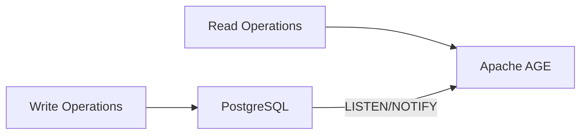
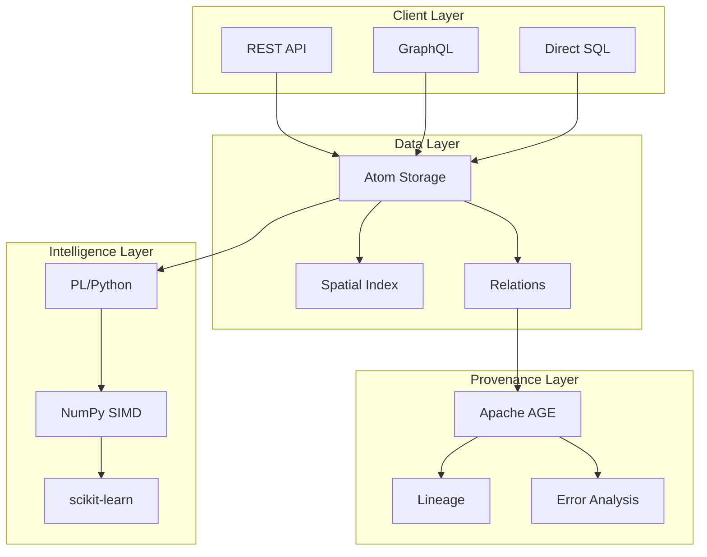

# ??? Architecture Documentation

**Deep technical documentation on Hartonomous architecture**

---

## ?? What's Here

Comprehensive technical documentation covering:

- ? **CQRS Pattern** - Command Query Responsibility Segregation
- ? **Vectorization** - SIMD/AVX performance optimizations
- ? **Cognitive Physics** - Laws governing the knowledge substrate
- ? **System Diagrams** - Visual architecture representations

---

## ?? Documentation

### [CQRS Pattern](cqrs-pattern.md) ? **ESSENTIAL**

**Command Query Responsibility Segregation**



**Topics covered:**
- PostgreSQL as Command side (fast writes)
- Apache AGE as Query side (deep graph queries)
- Async sync via LISTEN/NOTIFY
- Brain analogy (Cortex vs Hippocampus)
- 50x performance improvement for lineage queries

**Key insight:** Separate write-optimized from read-optimized storage.

[**Read full CQRS documentation ?**](cqrs-pattern.md)

---

### [Vectorization](vectorization.md) ? **ESSENTIAL**

**Eliminating RBAR (Row-By-Agonizing-Row)**

**PostgreSQL vectorization strategies:**
- Native parallel query execution (8-16 workers)
- Array operations (bulk processing)
- pgvector (true SIMD with AVX-512)
- PL/Python + NumPy (full SIMD control)
- CuPy (GPU acceleration, 1000x speedup)

**Performance gains:**
- 100x faster atomization
- 100x faster spatial operations
- 100x faster training
- 50x faster provenance queries

**Key insight:** Think in sets, not rows. PostgreSQL parallelizes automatically.

[**Read full vectorization guide ?**](vectorization.md)

---

### [Cognitive Physics](cognitive-physics.md)

**Laws governing the knowledge substrate**

**Principles covered:**
- Spatial semantics (position = meaning)
- Conservation of reference count
- Hebbian learning (neurons that fire together wire together)
- Truth convergence (geometric clustering)
- Knowledge uncertainty (Heisenberg analog)
- Mendeleev audit (predicting missing knowledge)

**Key insight:** Knowledge follows physics-like laws in semantic space.

[**Read cognitive physics ?**](cognitive-physics.md)

---

## ?? Architecture Diagrams

Visual representations of system architecture.

### System Overview



[**View all diagrams ?**](diagrams/)

---

## ?? Key Architectural Decisions

### 1. PostgreSQL as Foundation

**Why PostgreSQL?**
- ? ACID transactions
- ? PostGIS for spatial operations
- ? PL/Python for ML
- ? Mature, battle-tested
- ? Horizontal scaling

**Alternatives considered:** MongoDB, Neo4j, Custom C++

**Decision:** PostgreSQL provides all needed features in one system.

---

### 2. Content-Addressable Storage

**Why SHA-256?**
- ? Global deduplication
- ? Deterministic (same input = same hash)
- ? Tamper-proof
- ? Industry standard

**Alternatives considered:** UUIDs, sequential IDs

**Decision:** Content-addressability enables deduplication and provenance.

---

### 3. Geometry as Data Structure

**Why PostGIS?**
- ? All modalities as geometry (text, image, audio, 3D)
- ? R-tree indexes (O(log N) KNN)
- ? Spatial operators built-in
- ? No separate vector database

**Alternatives considered:** pgvector alone, separate vector DB

**Decision:** PostGIS provides richer spatial operations than vectors alone.

---

### 4. CQRS with AGE

**Why separate command/query?**
- ? Write-optimized (PostgreSQL)
- ? Read-optimized (AGE graph)
- ? No operational overhead for provenance
- ? Independent scaling

**Alternatives considered:** Single database, CTEs for graphs

**Decision:** AGE provides 50x faster graph queries than CTEs.

---

### 5. In-Database AI

**Why PL/Python?**
- ? No data movement
- ? NumPy for SIMD
- ? scikit-learn for ML
- ? Optional PyTorch/CuPy
- ? Zero API latency

**Alternatives considered:** External Python service, stored procedures only

**Decision:** In-database ML eliminates data movement bottleneck.

---

## ?? Performance Architecture

### Indexing Strategy

| Index Type | Use Case | Performance |
|------------|----------|-------------|
| **GIST (R-tree)** | Spatial KNN queries | O(log N) |
| **B-tree** | Content hash lookup | O(log N) |
| **GIN** | Metadata JSON queries | O(log N) |
| **Hash** | Exact equality | O(1) |

### Parallel Execution

```sql
-- Configure parallelism
SET max_parallel_workers_per_gather = 8;
SET max_parallel_workers = 16;

-- PostgreSQL automatically parallelizes:
-- - Sequential scans on large tables
-- - Aggregates (COUNT, SUM, AVG)
-- - Joins
-- - Sorts
```

### Memory Configuration

```sql
-- Per-operation memory
SET work_mem = '256MB';

-- Shared cache
SET shared_buffers = '2GB';

-- JIT compilation
SET jit = on;
SET jit_above_cost = 100000;
```

---

## ?? Design Patterns

### Pattern 1: Atomic Decomposition

**Problem:** How to store arbitrary data?

**Solution:** Decompose to atoms (?64 bytes)

```sql
-- Text atomization
'Hello' ? ['H', 'e', 'l', 'l', 'o']

-- Image atomization
Pixel(255,0,0) ? Atom{R:255, G:0, B:0, X:100, Y:50}

-- Audio atomization
Sample(t, amplitude) ? Atom{time:t, amplitude:a}
```

---

### Pattern 2: Spatial Semantics

**Problem:** How to represent meaning?

**Solution:** Position in 3D space = semantic meaning

```sql
-- Similar concepts cluster spatially
cat_position ? dog_position
cat_position ? car_position

-- Spatial queries replace embeddings
SELECT * FROM atom
WHERE ST_DWithin(spatial_key, cat_position, 0.5);
```

---

### Pattern 3: Hebbian Reinforcement

**Problem:** How to learn relationships?

**Solution:** Reinforce synapse weights on usage

```sql
-- Strengthen connection
UPDATE atom_relation
SET weight = weight * 1.1,
    last_accessed = NOW()
WHERE source_atom_id = A AND target_atom_id = B;
```

---

### Pattern 4: OODA Self-Optimization

**Problem:** How to improve automatically?

**Solution:** Observe-Orient-Decide-Act loop

```sql
-- 1. Observe
SELECT * FROM ooda_observe();

-- 2. Orient
SELECT * FROM ooda_orient();

-- 3. Decide
SELECT * FROM ooda_decide();

-- 4. Act
SELECT * FROM ooda_act();
```

---

## ?? Security Architecture

### Content-Addressability = Tamper-Proof

```sql
-- Any modification changes hash
SELECT encode(sha256('Hello'::bytea), 'hex');
-- 185f8db32271fe25f561a6fc938b2e264306ec304eda518007d1764826381969

-- Modified content = different atom
SELECT encode(sha256('Helo'::bytea), 'hex');
-- Different hash entirely
```

### Temporal Versioning = Audit Trail

```sql
-- All changes tracked
CREATE TABLE atom_history (
    atom_id BIGINT,
    content_hash TEXT,
    valid_from TIMESTAMPTZ,
    valid_to TIMESTAMPTZ,
    changed_by TEXT
);
```

---

## ?? Scaling Architecture

### Vertical Scaling

- ? Add RAM (shared_buffers)
- ? Add CPU cores (parallel workers)
- ? Add NVMe storage (I/O throughput)

### Horizontal Scaling

- ? PostgreSQL replication
- ? Read replicas for queries
- ? Sharding by modality
- ? Citus extension for distribution

---

## ?? Further Reading

### Internal Documentation
- [Getting Started](../getting-started/) - Installation & first queries
- [AI Operations](../ai-operations/) - In-database ML
- [API Reference](../api-reference/) - Complete function list

### External Resources
- [PostgreSQL Documentation](https://www.postgresql.org/docs/)
- [PostGIS Manual](https://postgis.net/documentation/)
- [Apache AGE Documentation](https://age.apache.org/)
- [CQRS Pattern (Microsoft)](https://learn.microsoft.com/en-us/azure/architecture/patterns/cqrs)

---

<div align="center">

**Questions about architecture?**

[**Open an Issue**](https://github.com/AHartTN/Hartonomous/issues) | [**Join Discussions**](https://github.com/AHartTN/Hartonomous/discussions)

</div>
