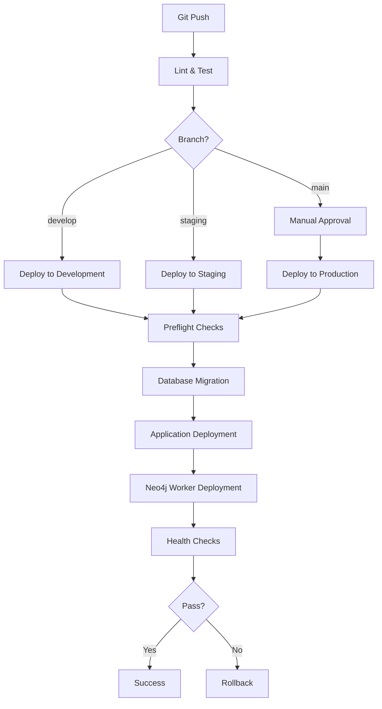
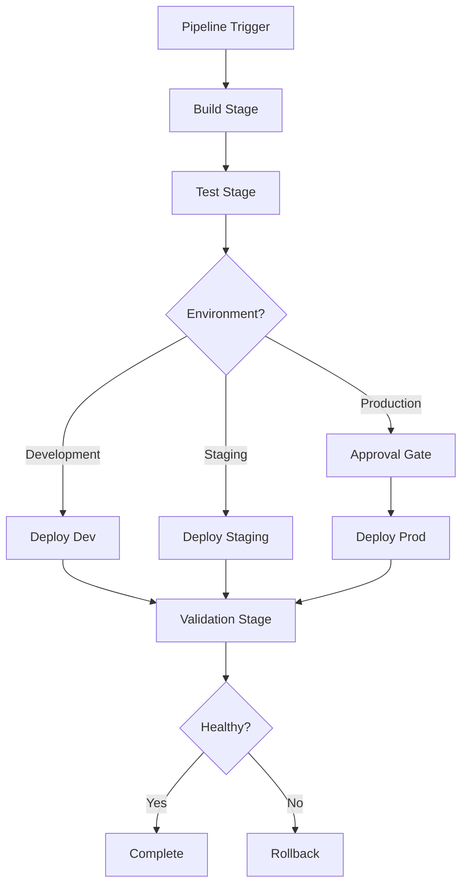

# Hartonomous Deployment Architecture

**Enterprise-Grade CI/CD System**

> **Philosophy**: Agnostic, Idempotent, Composable, Secure

---

## 🏗️ Architecture Overview

### Design Principles

1. **Platform Agnostic**: Scripts work on Windows (PowerShell) AND Linux (Bash)
2. **Fully Idempotent**: Safe to run multiple times, same result
3. **Separation of Concerns**: Each script has ONE responsibility
4. **No Inline Scripts**: YAML files reference scripts only
5. **SOLID Principles**: Single responsibility, Open/Closed, Liskov substitution, Interface segregation, Dependency inversion
6. **DRY**: Shared logic in common modules
7. **Security First**: Secrets via Key Vault, least privilege, audit trails

---

## 📁 Directory Structure

```
hartonomous/
├── .github/
│   ├── workflows/                    # GitHub Actions workflows
│   │   ├── deploy-development.yml
│   │   ├── deploy-staging.yml
│   │   ├── deploy-production.yml
│   │   ├── lint.yml
│   │   └── test.yml
│   └── scripts/                      # GitHub-specific scripts
│       └── setup-environment.ps1
│
├── .azuredevops/
│   ├── pipelines/                    # Azure Pipelines YAML
│   │   ├── deploy-development.yml
│   │   ├── deploy-staging.yml
│   │   ├── deploy-production.yml
│   │   ├── lint.yml
│   │   └── test.yml
│   └── templates/                    # Reusable YAML templates
│       ├── build-template.yml
│       ├── deploy-template.yml
│       └── test-template.yml
│
├── deployment/
│   ├── scripts/                      # Cross-platform deployment scripts
│   │   ├── common/                   # Shared utilities
│   │   │   ├── logger.ps1            # PowerShell logging
│   │   │   ├── logger.sh             # Bash logging
│   │   │   ├── azure-auth.ps1        # Azure authentication
│   │   │   ├── azure-auth.sh
│   │   │   ├── config-loader.ps1     # Configuration management
│   │   │   └── config-loader.sh
│   │   │
│   │   ├── preflight/                # Pre-deployment checks
│   │   │   ├── check-prerequisites.ps1
│   │   │   ├── check-prerequisites.sh
│   │   │   ├── validate-secrets.ps1
│   │   │   └── validate-secrets.sh
│   │   │
│   │   ├── database/                 # Database deployment
│   │   │   ├── deploy-schema.ps1
│   │   │   ├── deploy-schema.sh
│   │   │   ├── migrate-data.ps1
│   │   │   └── migrate-data.sh
│   │   │
│   │   ├── application/              # Application deployment
│   │   │   ├── deploy-api.ps1
│   │   │   ├── deploy-api.sh
│   │   │   ├── configure-service.ps1
│   │   │   └── configure-service.sh
│   │   │
│   │   ├── neo4j/                    # Neo4j deployment
│   │   │   ├── deploy-neo4j-worker.ps1
│   │   │   ├── deploy-neo4j-worker.sh
│   │   │   ├── configure-neo4j.ps1
│   │   │   └── configure-neo4j.sh
│   │   │
│   │   ├── validation/               # Post-deployment validation
│   │   │   ├── health-check.ps1
│   │   │   ├── health-check.sh
│   │   │   ├── smoke-test.ps1
│   │   │   └── smoke-test.sh
│   │   │
│   │   └── rollback/                 # Rollback procedures
│   │       ├── rollback-deployment.ps1
│   │       └── rollback-deployment.sh
│   │
│   ├── config/                       # Environment configurations
│   │   ├── development.json
│   │   ├── staging.json
│   │   └── production.json
│   │
│   └── templates/                    # Infrastructure as Code
│       ├── bicep/                    # Azure Bicep templates
│       │   ├── main.bicep
│       │   ├── networking.bicep
│       │   ├── compute.bicep
│       │   └── monitoring.bicep
│       └── arm/                      # ARM templates (legacy)
│
└── docs/
    └── deployment/
        ├── DEPLOYMENT-ARCHITECTURE.md  # This file
        ├── DEPLOYMENT-GUIDE.md         # Step-by-step guide
        ├── TROUBLESHOOTING.md          # Common issues
        └── RUNBOOK.md                  # Operations runbook
```

---

## 🔄 Deployment Flow

### GitHub Actions Flow



### Azure Pipelines Flow



---

## 🎯 Deployment Targets

### Development Environment

**Targets**:
- HART-DESKTOP (Windows 11, Arc-enabled)
- Development database: `Hartonomous-DEV-development`
- Neo4j Desktop local instance

**Deployment Method**:
- GitHub Actions self-hosted runner (HART-DESKTOP)
- OR Azure Pipeline agent (HART-DESKTOP)

**Trigger**:
- Automatic on push to `develop` branch

**Approval**: None (auto-deploy)

---

### Staging Environment

**Targets**:
- hart-server (Ubuntu 22.04, Arc-enabled)
- Staging database: TBD
- Neo4j Community Edition

**Deployment Method**:
- GitHub Actions self-hosted runner (hart-server)
- OR Azure Pipeline deployment group (hart-server)

**Trigger**:
- Automatic on push to `staging` branch

**Approval**: Optional (can enable)

---

### Production Environment

**Targets**:
- hart-server (Ubuntu 22.04, Arc-enabled)
- Production database: `Hartonomous` (PostgreSQL on Arc SQL)
- Neo4j Community Edition

**Deployment Method**:
- GitHub Actions with manual approval
- OR Azure Pipeline with approval gate

**Trigger**:
- Manual workflow dispatch
- OR tag push (`v*.*.*`)

**Approval**: **REQUIRED** (manual approval before deploy)

---

## 🔐 Security Architecture

### Secret Management Hierarchy

```
Level 1: Azure Key Vault (Source of Truth)
   ├── PostgreSQL-Hartonomous-Password
   ├── Neo4j-hart-server-Password
   ├── AzureAd-ClientSecret
   └── EntraExternalId-ClientSecret

Level 2: GitHub Secrets (CI/CD credentials)
   ├── AZURE_CLIENT_ID
   ├── AZURE_CLIENT_SECRET
   ├── AZURE_TENANT_ID
   └── AZURE_SUBSCRIPTION_ID

Level 3: GitHub Environments (Environment-specific)
   ├── Development
   │   ├── DEPLOYMENT_TARGET=HART-DESKTOP
   │   └── ENVIRONMENT=development
   ├── Staging
   │   ├── DEPLOYMENT_TARGET=hart-server
   │   └── ENVIRONMENT=staging
   └── Production
       ├── DEPLOYMENT_TARGET=hart-server
       ├── ENVIRONMENT=production
       └── APPROVAL_REQUIRED=true
```

### Authentication Flow

```
1. Workflow/Pipeline starts
   ↓
2. Authenticate to Azure using Service Principal
   (GitHub Secret: AZURE_CLIENT_ID, AZURE_CLIENT_SECRET)
   ↓
3. Access Key Vault using Service Principal
   (Role: Key Vault Secrets User)
   ↓
4. Retrieve application secrets
   (PostgreSQL password, Neo4j password, etc.)
   ↓
5. Deploy to target using Arc-enabled machine
   (Via SSH for Linux, WinRM for Windows)
   ↓
6. Configure application with secrets
   (Environment variables, config files)
```

---

## 📦 Deployment Stages

### Stage 1: Preflight Checks

**Purpose**: Validate environment before deployment

**Scripts**:
- `deployment/scripts/preflight/check-prerequisites.{ps1,sh}`
- `deployment/scripts/preflight/validate-secrets.{ps1,sh}`

**Checks**:
- ✅ Target machine is online and accessible
- ✅ Required services are installed (PostgreSQL, Neo4j, Python)
- ✅ Disk space available (>10GB)
- ✅ Azure connectivity (Arc agent connected)
- ✅ Secrets exist in Key Vault
- ✅ Service Principal has required permissions

**Output**: `PASS` or `FAIL` (exit code 0 or 1)

---

### Stage 2: Database Migration

**Purpose**: Deploy schema changes and data migrations

**Scripts**:
- `deployment/scripts/database/deploy-schema.{ps1,sh}`
- `deployment/scripts/database/migrate-data.{ps1,sh}`

**Steps**:
1. Backup current database
2. Apply schema changes (idempotent SQL scripts)
3. Run data migrations (if needed)
4. Verify schema integrity
5. Update migration version

**Rollback**: Restore from backup if any step fails

---

### Stage 3: Application Deployment

**Purpose**: Deploy API and worker services

**Scripts**:
- `deployment/scripts/application/deploy-api.{ps1,sh}`
- `deployment/scripts/neo4j/deploy-neo4j-worker.{ps1,sh}`

**Steps**:
1. Stop existing services (graceful shutdown)
2. Backup current application files
3. Deploy new application files
4. Update configuration files (environment-specific)
5. Install Python dependencies
6. Start services
7. Verify services are running

**Rollback**: Restore backup and restart previous version

---

### Stage 4: Validation

**Purpose**: Verify deployment was successful

**Scripts**:
- `deployment/scripts/validation/health-check.{ps1,sh}`
- `deployment/scripts/validation/smoke-test.{ps1,sh}`

**Tests**:
- ✅ API responds to `/health` endpoint
- ✅ Database connection successful
- ✅ Neo4j worker connected
- ✅ Sample data ingest works
- ✅ Provenance graph updates
- ✅ No errors in logs

**Output**: `PASS` or `FAIL`

**Action on Fail**: Automatic rollback

---

## 🔧 Script Design Patterns

### Idempotency Pattern

```powershell
# ❌ BAD: Not idempotent
Install-Service "Hartonomous-API"

# ✅ GOOD: Idempotent
if (-not (Get-Service "Hartonomous-API" -ErrorAction SilentlyContinue)) {
    Install-Service "Hartonomous-API"
    Write-Log "Service installed"
} else {
    Write-Log "Service already exists, skipping installation"
}
```

### Error Handling Pattern

```powershell
# Strict error handling
$ErrorActionPreference = "Stop"
Set-StrictMode -Version Latest

try {
    # Deployment logic
    Deploy-Application
    Write-Log "Deployment successful"
    exit 0
} catch {
    Write-Log "ERROR: $($_.Exception.Message)" -Level Error
    Invoke-Rollback
    exit 1
}
```

### Logging Pattern

```powershell
# Centralized logging
. "$PSScriptRoot/../common/logger.ps1"

Write-Log "Starting deployment" -Level Info
Write-Log "Configuration loaded" -Level Debug
Write-Log "WARNING: Using development secrets" -Level Warning
Write-Log "ERROR: Deployment failed" -Level Error
```

### Configuration Pattern

```powershell
# Configuration loading
. "$PSScriptRoot/../common/config-loader.ps1"

$config = Get-Configuration -Environment $env:DEPLOYMENT_ENVIRONMENT
$dbHost = $config.database.host
$dbPort = $config.database.port
```

---

## 🌐 Environment Variables

### Required Environment Variables

| Variable | Description | Source |
|----------|-------------|--------|
| `DEPLOYMENT_ENVIRONMENT` | Environment name (development/staging/production) | GitHub/Azure |
| `DEPLOYMENT_TARGET` | Target machine (HART-DESKTOP/hart-server) | GitHub/Azure |
| `AZURE_TENANT_ID` | Azure AD tenant ID | GitHub Secret |
| `AZURE_CLIENT_ID` | Service Principal client ID | GitHub Secret |
| `AZURE_CLIENT_SECRET` | Service Principal secret | GitHub Secret |
| `AZURE_SUBSCRIPTION_ID` | Azure subscription ID | GitHub Secret |
| `KEY_VAULT_URL` | Key Vault URL | Config file |
| `APP_CONFIG_ENDPOINT` | App Configuration endpoint | Config file |

### Optional Environment Variables

| Variable | Description | Default |
|----------|-------------|---------|
| `DEPLOYMENT_VERSION` | Version to deploy | `latest` |
| `SKIP_TESTS` | Skip validation tests | `false` |
| `ENABLE_ROLLBACK` | Enable auto-rollback on failure | `true` |
| `LOG_LEVEL` | Logging verbosity (DEBUG/INFO/WARNING/ERROR) | `INFO` |

---

## 📊 Monitoring & Observability

### Deployment Metrics

**Tracked Metrics**:
- Deployment duration
- Success/failure rate
- Rollback frequency
- Time to rollback
- Health check response time

**Storage**: Azure Application Insights

### Logging

**Log Levels**:
- `DEBUG`: Detailed diagnostic information
- `INFO`: General informational messages
- `WARNING`: Warning messages (deployment continues)
- `ERROR`: Error messages (deployment fails)

**Log Destinations**:
- Console (stdout/stderr)
- File (`/var/log/hartonomous/deployment.log`)
- Azure Application Insights

### Alerting

**Alert Triggers**:
- Deployment failure
- Rollback triggered
- Health check failure
- Service stopped unexpectedly

**Alert Channels**:
- Email (aharttn@gmail.com)
- GitHub issue (auto-created)
- Azure Monitor alerts

---

## 🔄 Rollback Strategy

### Automatic Rollback

**Triggers**:
- Health check failure
- Smoke test failure
- Service won't start
- Database migration error

**Process**:
1. Log rollback trigger
2. Stop new services
3. Restore application backup
4. Restore database backup (if migration failed)
5. Start previous services
6. Verify health checks pass
7. Create incident report

### Manual Rollback

**Command**:
```bash
# GitHub Actions
gh workflow run rollback.yml -f environment=production -f version=v1.2.3

# Azure Pipelines
az pipelines run --name rollback-pipeline --parameters environment=production version=v1.2.3
```

---

## 🎓 Best Practices

### Do's ✅

- ✅ Use environment-specific configuration files
- ✅ Store secrets in Azure Key Vault only
- ✅ Test deployments in development first
- ✅ Always backup before migration
- ✅ Use semantic versioning (v1.2.3)
- ✅ Log every deployment action
- ✅ Validate after every deployment
- ✅ Use idempotent scripts

### Don'ts ❌

- ❌ Never hardcode secrets in scripts
- ❌ Never commit secrets to git
- ❌ Never deploy without preflight checks
- ❌ Never skip validation tests
- ❌ Never deploy manually without CI/CD
- ❌ Never inline scripts in YAML
- ❌ Never deploy during business hours (production)
- ❌ Never skip approval gates (production)

---

## 📚 Related Documentation

- [Deployment Guide](DEPLOYMENT-GUIDE.md) - Step-by-step deployment instructions
- [Troubleshooting](TROUBLESHOOTING.md) - Common issues and solutions
- [Runbook](RUNBOOK.md) - Operations runbook
- [Neo4j Implementation](../development/NEO4J-IMPLEMENTATION.md) - Neo4j deployment specifics

---

**Copyright © 2025 Anthony Hart. All Rights Reserved.**
