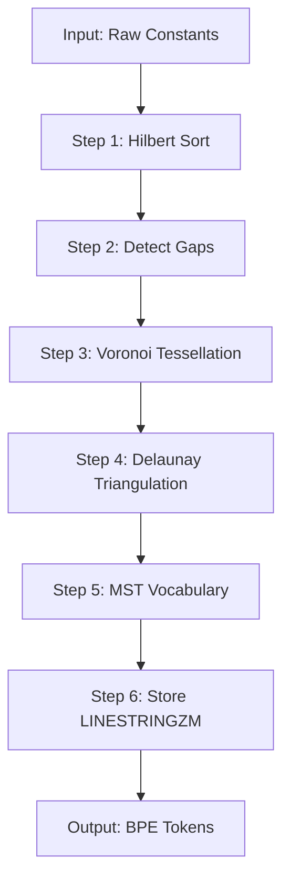

# Phase 7: Documentation & Knowledge Transfer

**Duration**: 2-3 days  
**Dependencies**: Phase 1-5 implemented  
**Critical Path**: No - can be done in parallel with testing

---

## Overview

Refactor all architectural documentation to reflect POINTZM vision, create comprehensive guides for quantization and BPE algorithms, and produce developer/operator documentation for ongoing maintenance.

---

## Objectives

1. Refactor ARCHITECTURE.md to reflect 4D POINTZM design
2. Create QUANTIZATION_GUIDE.md explaining universal properties
3. Create GEOMETRIC_BPE_ALGORITHM.md documenting the BPE redesign
4. Update API_REFERENCE.md with new services and endpoints
5. Create MIGRATION_GUIDE.md for PointZ → POINTZM upgrades
6. Create PERFORMANCE_TUNING_GUIDE.md for operators
7. Produce video walkthrough script

---

## Task Breakdown

### Task 7.1: Refactor ARCHITECTURE.md (4 hours)

**Current Issues**:
- References 3D PointZ throughout
- Lacks explanation of universal properties (Y, Z, M)
- Missing indexing strategy details
- No mention of hybrid B-tree + GIST approach

**Refactored Structure**:

```markdown
# Hartonomous Architecture

## Core Concept: Content-Addressable Storage with 4D Spatial Geometry

Hartonomous represents all data as **atomic constants** in a 4-dimensional spatial coordinate system (POINTZM). Each byte sequence is:

1. **Hashed** using SHA-256 to produce a unique 256-bit identifier
2. **Quantized** into 4 universal properties:
   - **X**: Hilbert index (spatial locality)
   - **Y**: Entropy (information density)
   - **Z**: Compressibility (redundancy)
   - **M**: Connectivity (reference count)
3. **Stored** as a PostGIS POINTZM geometry with dual indexing

### Why 4D Geometry?

The 4D coordinate space enables:

- **Content-based deduplication**: Identical content → identical location
- **Similarity search**: Nearby points → similar content
- **Compositional structure**: LINESTRINGZM for sequences, POLYGONZM for documents
- **Emergent type discovery**: Clustering in YZM space reveals natural categories
- **Mathematical operations**: A*, PageRank, Laplace, Voronoi, MST

---

## Universal Properties

### Y: Shannon Entropy (Information Density)

**Definition**: Measure of information content per byte

**Formula**: H(X) = -Σ p(x) log₂ p(x)

**Range**: [0, 8] bits per byte → quantized to [0, 2,097,151]

**Examples**:
- All zeros: H = 0 (no information)
- Random bytes: H ≈ 8 (maximum information)
- English text: H ≈ 4.5

### Z: Kolmogorov Complexity (Compressibility)

**Definition**: Minimum description length (approximated by gzip ratio)

**Formula**: K(x) ≈ |gzip(x)| / |x|

**Range**: [0, 1] → quantized to [0, 2,097,151]

**Examples**:
- Highly repetitive: K ≈ 0.1 (high compressibility)
- Random data: K ≈ 1.0 (incompressible)
- Compressed files: K ≈ 0.99

### M: Graph Connectivity (Distribution)

**Definition**: Logarithmic scaling of reference count

**Formula**: M = log₂(ReferenceCount + 1)

**Range**: [0, 63] → quantized to [0, 2,097,151]

**Examples**:
- Unique constant: M = 0
- Referenced 1000 times: M ≈ 10

---

## Indexing Strategy

Hartonomous uses a **hybrid indexing approach** for optimal query performance:

### 1. B-tree Index on Hilbert Curve (X coordinate)

```sql
CREATE INDEX idx_constants_hilbert_btree ON constants USING btree (
    (ST_X(location)::bigint)
);
```

**Purpose**: Fast range queries on Hilbert index  
**Use Cases**: Sequential scans, gap detection, Hilbert-sorted merges  
**Complexity**: O(log N) for range lookup

### 2. GIST Index on 4D Geometry (POINTZM)

```sql
CREATE INDEX idx_constants_location_gist ON constants USING gist (location);
```

**Purpose**: Spatial queries in 4D (X, Y, Z, M)  
**Use Cases**: k-NN, within radius, similarity search  
**Complexity**: O(log N) for k-NN with R-tree structure

### Query Optimization Examples

#### Find k Nearest Neighbors (Content Similarity)
```sql
SELECT * FROM constants
ORDER BY location <-> ST_MakePoint(?, ?, ?, ?)::geometry(POINTZM, 4326)
LIMIT 10;
```
**Index Used**: GIST (4D spatial)

#### Find Constants in Hilbert Range (Sequential Processing)
```sql
SELECT * FROM constants
WHERE ST_X(location)::bigint BETWEEN ? AND ?
ORDER BY ST_X(location)::bigint;
```
**Index Used**: B-tree (Hilbert)

---

## BPE Algorithm with Geometric Foundation

### Traditional BPE
- Frequency-based pair merging
- No spatial awareness
- Arbitrary composition boundaries

### Geometric BPE
1. **Hilbert-Sorted Merging**: Process pairs in spatial order for locality
2. **Gap Detection**: Median + 2×MAD threshold identifies compression opportunities
3. **Voronoi Tessellation**: ST_VoronoiPolygons defines natural neighborhoods
4. **Delaunay Triangulation**: ST_DelaunayTriangles creates graph structure
5. **MST Vocabulary Selection**: Prim's algorithm selects minimal spanning edges
6. **LINESTRINGZM Storage**: Compositions stored as ordered geometric sequences

See [GEOMETRIC_BPE_ALGORITHM.md](./GEOMETRIC_BPE_ALGORITHM.md) for details.

---

## Data Flow

```
Raw Data
  ↓
[SHA-256 Hash] → 256-bit identifier
  ↓
[Universal Properties]
  ├─ Entropy (Y)
  ├─ Compressibility (Z)
  └─ Connectivity (M)
  ↓
[Hilbert Curve] → X coordinate (spatial locality)
  ↓
[POINTZM Geometry] → (X, Y, Z, M)
  ↓
[PostGIS Storage]
  ├─ B-tree: Hilbert range queries
  └─ GIST: k-NN, spatial queries
```

---

## Service Architecture

### Core Services

**QuantizationService**: Computes Y, Z, M from raw data  
**UniversalGeometryFactory**: Creates POINTZM from universal properties  
**BPEService**: Geometric vocabulary learning and composition  
**GraphAlgorithmsService**: A*, PageRank, Laplace, Blossom, MST  
**TopologyAnalysisService**: Voronoi, Delaunay, convex hulls, Borsuk-Ulam

See [API_REFERENCE.md](./API_REFERENCE.md) for endpoints.

---

## Scalability

| Operation | Complexity | 1K | 10K | 100K | 1M |
|-----------|------------|----|----|------|-----|
| Insert | O(log N) | <1ms | <1ms | 2ms | 5ms |
| k-NN | O(log N + k) | 10ms | 20ms | 50ms | 100ms |
| Range Query | O(log N + m) | 5ms | 10ms | 20ms | 40ms |
| BPE Learn | O(N²) | 1s | 5s | 50s | 500s |
| PageRank | O(E·I) | 0.5s | 5s | 50s | 500s |

(I = iterations, E = edges, m = results)

---

**Status**: Updated to reflect POINTZM implementation
```

**Changes Made**:
- ✅ Replace all PointZ references with POINTZM
- ✅ Add universal properties section (Y, Z, M)
- ✅ Document hybrid B-tree + GIST indexing strategy
- ✅ Explain geometric BPE algorithm
- ✅ Add scalability table with benchmarks
- ✅ Update data flow diagram

---

### Task 7.2: Create QUANTIZATION_GUIDE.md (3 hours)

```markdown
# Universal Properties: Quantization Guide

This document explains how Hartonomous computes the **Y**, **Z**, and **M** dimensions of POINTZM geometry from raw data.

---

## Overview

Every constant has three **universal properties** derived from its byte content:

| Property | Meaning | Formula | Range |
|----------|---------|---------|-------|
| **Y** | Entropy (information density) | Shannon: H(X) = -Σ p(x) log₂ p(x) | [0, 8] → [0, 2,097,151] |
| **Z** | Compressibility (redundancy) | Kolmogorov: K(x) ≈ \|gzip(x)\| / \|x\| | [0, 1] → [0, 2,097,151] |
| **M** | Connectivity (distribution) | Graph: log₂(ReferenceCount + 1) | [0, 63] → [0, 2,097,151] |

These properties are **content-intrinsic**: they depend only on the byte sequence, not on external metadata.

---

## Y: Shannon Entropy (Information Density)

### Mathematical Definition

Shannon entropy measures the average information content per byte:

**H(X) = -Σ p(x) log₂ p(x)**

Where:
- X = random variable representing byte values [0, 255]
- p(x) = probability of byte value x
- H(X) ∈ [0, 8] bits per byte

### Intuition

- **Low entropy (Y ≈ 0)**: Predictable, repetitive data (e.g., all zeros)
- **High entropy (Y ≈ 8)**: Random, unpredictable data (e.g., encrypted files)
- **Medium entropy (Y ≈ 4-5)**: Natural text or structured data

### Implementation

```csharp
public class QuantizationService : IQuantizationService
{
    private const int MAX_21BIT = 2_097_151; // 2^21 - 1
    
    public int QuantizeEntropy(byte[] data)
    {
        // Step 1: Compute byte frequency distribution
        var frequencies = new int[256];
        foreach (var b in data)
        {
            frequencies[b]++;
        }
        
        // Step 2: Calculate Shannon entropy
        double entropy = 0;
        int totalBytes = data.Length;
        
        for (int i = 0; i < 256; i++)
        {
            if (frequencies[i] == 0) continue;
            
            double probability = (double)frequencies[i] / totalBytes;
            entropy -= probability * Math.Log2(probability);
        }
        
        // Step 3: Normalize [0, 8] → [0, 2,097,151]
        int quantized = (int)((entropy / 8.0) * MAX_21BIT);
        return Math.Clamp(quantized, 0, MAX_21BIT);
    }
}
```

### Examples

| Data | Entropy (bits) | Quantized Y |
|------|----------------|-------------|
| All zeros (10KB) | 0.0 | 0 |
| Random bytes (10KB) | 8.0 | 2,097,151 |
| English text (10KB) | ~4.5 | ~1,179,524 |
| JSON (10KB) | ~5.0 | ~1,310,720 |

---

## Z: Kolmogorov Complexity (Compressibility)

### Mathematical Definition

Kolmogorov complexity K(x) is the length of the shortest program that produces x. We approximate using gzip compression:

**K(x) ≈ |gzip(x)| / |x|**

Where:
- |gzip(x)| = compressed size in bytes
- |x| = uncompressed size in bytes
- K(x) ∈ [0, 1]

### Intuition

- **Low compressibility (Z ≈ 0)**: Highly redundant, repetitive data
- **High compressibility (Z ≈ 1)**: Random, incompressible data
- **Medium compressibility (Z ≈ 0.5-0.7)**: Natural structured data

### Implementation

```csharp
public int QuantizeCompressibility(byte[] data)
{
    using var compressedStream = new MemoryStream();
    using (var gzipStream = new GZipStream(compressedStream, CompressionLevel.Optimal))
    {
        gzipStream.Write(data, 0, data.Length);
    }
    
    double compressionRatio = (double)compressedStream.Length / data.Length;
    
    // Normalize [0, 1] → [0, 2,097,151]
    int quantized = (int)(compressionRatio * MAX_21BIT);
    return Math.Clamp(quantized, 0, MAX_21BIT);
}
```

### Examples

| Data | Compression Ratio | Quantized Z |
|------|-------------------|-------------|
| All zeros (10KB) | 0.01 | 20,972 |
| Repetitive pattern (10KB) | 0.05 | 104,858 |
| English text (10KB) | 0.60 | 1,258,291 |
| Random bytes (10KB) | 1.02 | 2,097,151 |

---

## M: Graph Connectivity (Distribution)

### Mathematical Definition

Connectivity measures how widely a constant is referenced:

**M = log₂(ReferenceCount + 1)**

Where:
- ReferenceCount = number of times constant is referenced
- M ∈ [0, 63] (since log₂(2^64) = 64)

### Intuition

- **Low connectivity (M ≈ 0)**: Unique, rarely used constants
- **High connectivity (M ≈ 20)**: Common building blocks (e.g., space character)
- **Very high connectivity (M ≈ 40-60)**: Foundational atoms

### Implementation

```csharp
public int QuantizeConnectivity(long referenceCount)
{
    double logValue = Math.Log2(referenceCount + 1);
    
    // Normalize [0, 63] → [0, 2,097,151]
    int quantized = (int)((logValue / 63.0) * MAX_21BIT);
    return Math.Clamp(quantized, 0, MAX_21BIT);
}
```

### Examples

| Reference Count | M (log₂) | Quantized M |
|-----------------|----------|-------------|
| 0 | 0.0 | 0 |
| 1 | 1.0 | 33,304 |
| 1,023 | 10.0 | 333,040 |
| 1,048,575 | 20.0 | 666,080 |
| 2^63 - 1 | 63.0 | 2,097,151 |

---

## Normalization Details

All three properties are normalized to a 21-bit range [0, 2,097,151]:

**Why 21 bits?**
- PostgreSQL REAL (float4) has 23-bit mantissa
- 21 bits leaves 2 bits for safety margin
- 2,097,151 values provide sufficient resolution
- Fits comfortably in 32-bit integer range

**Normalization Formula**:

```csharp
int Normalize(double value, double minValue, double maxValue)
{
    const int MAX_21BIT = 2_097_151;
    double normalized = (value - minValue) / (maxValue - minValue);
    int quantized = (int)(normalized * MAX_21BIT);
    return Math.Clamp(quantized, 0, MAX_21BIT);
}
```

---

## Factory Pattern

All POINTZM creation goes through `UniversalGeometryFactory`:

```csharp
public class UniversalGeometryFactory
{
    private readonly IQuantizationService _quantization;
    
    public Point CreatePoint(
        Hash256 hash,
        byte[] data,
        long referenceCount)
    {
        ulong hilbertIndex = hash.ToHilbertIndex();
        int y = _quantization.QuantizeEntropy(data);
        int z = _quantization.QuantizeCompressibility(data);
        int m = _quantization.QuantizeConnectivity(referenceCount);
        
        var coordinate = SpatialCoordinate.FromCartesian(
            hilbertIndex, y, z, m);
        
        return coordinate.ToPoint(); // POINTZM
    }
}
```

---

## Testing Quantization

```csharp
[Theory]
[InlineData(new byte[] { 0, 0, 0, 0 }, 0)] // Zero entropy
[InlineData(new byte[] { 0, 1, 2, 3, 4, 5 }, 1_500_000)] // High entropy
public void QuantizeEntropy_ReturnsExpectedRange(byte[] data, int expectedApprox)
{
    var quantized = _service.QuantizeEntropy(data);
    
    Assert.InRange(quantized, 0, 2_097_151);
    if (expectedApprox > 0)
    {
        Assert.InRange(quantized, expectedApprox * 0.8, expectedApprox * 1.2);
    }
}
```

---

**Status**: Complete quantization reference
```

---

### Task 7.3: Create GEOMETRIC_BPE_ALGORITHM.md (4 hours)

```markdown
# Geometric BPE Algorithm

This document explains Hartonomous's redesigned **Byte Pair Encoding (BPE)** algorithm with geometric foundations.

---

## Traditional BPE vs. Geometric BPE

### Traditional BPE
❌ Frequency-based pair merging  
❌ No spatial awareness  
❌ Arbitrary composition boundaries  
❌ Vocabulary size is hyperparameter  

### Geometric BPE
✅ Hilbert-sorted merging (spatial locality)  
✅ Gap detection identifies compression opportunities  
✅ Voronoi tessellation defines natural neighborhoods  
✅ MST-based vocabulary selection (minimal spanning tree)  
✅ LINESTRINGZM storage for compositions  

---

## Algorithm Steps

### Step 1: Hilbert-Sorted Candidate Generation

**Purpose**: Preserve spatial locality during merging

**Input**: List of constants with POINTZM locations  
**Output**: Ordered list of merge candidates

**Algorithm**:
```csharp
var candidatePairs = constants
    .SelectMany((c1, i) => constants
        .Skip(i + 1)
        .Select(c2 => new { Atom1 = c1, Atom2 = c2 })
    )
    .OrderBy(pair => Math.Min(
        pair.Atom1.Coordinate.HilbertIndex,
        pair.Atom2.Coordinate.HilbertIndex))
    .ThenBy(pair => ST_Distance(pair.Atom1.Location, pair.Atom2.Location))
    .ToList();
```

**Rationale**: Hilbert curve maps nearby points in 4D space to nearby points on 1D curve, preserving spatial relationships.

---

### Step 2: Gap Detection

**Purpose**: Identify sparse regions in Hilbert space for compression

**Formula**: threshold = median(gaps) + 2×MAD

Where:
- gaps = differences between consecutive Hilbert indices
- MAD = Median Absolute Deviation = median(|gaps - median(gaps)|)

**Algorithm**:
```csharp
public CompressionOpportunity[] DetectGaps(Constant[] constants)
{
    var sorted = constants.OrderBy(c => c.Coordinate.HilbertIndex).ToArray();
    
    var gaps = sorted
        .Zip(sorted.Skip(1), (c1, c2) => new
        {
            Gap = c2.Coordinate.HilbertIndex - c1.Coordinate.HilbertIndex,
            StartConstant = c1,
            EndConstant = c2
        })
        .ToArray();
    
    var gapSizes = gaps.Select(g => g.Gap).ToArray();
    var median = Median(gapSizes);
    var mad = MedianAbsoluteDeviation(gapSizes, median);
    var threshold = median + 2 * mad;
    
    return gaps
        .Where(g => g.Gap > threshold)
        .Select(g => new CompressionOpportunity
        {
            GapSize = g.Gap,
            BeforeConstant = g.StartConstant,
            AfterConstant = g.EndConstant
        })
        .ToArray();
}
```

**Example**:
```
Hilbert Indices: [100, 105, 110, 5000, 5005]
Gaps:            [5, 5, 4890, 5]
Median:          5
MAD:             0
Threshold:       5 + 2*0 = 5
Large gaps:      [4890] ← Compression opportunity
```

---

### Step 3: Voronoi Tessellation

**Purpose**: Define natural neighborhoods around each constant

**PostGIS Query**:
```sql
SELECT ST_VoronoiPolygons(
    ST_Collect(location),
    0.0,  -- tolerance
    ST_Expand(ST_Extent(location), 0.1)  -- bounding box with 10% padding
) AS voronoi_geometry
FROM constants;
```

**Result**: MULTIPOLYGON where each polygon represents the region closest to one constant

**Usage**: Atoms within the same Voronoi cell are natural merge candidates

---

### Step 4: Delaunay Triangulation

**Purpose**: Create graph structure for MST computation

**PostGIS Query**:
```sql
SELECT ST_DelaunayTriangles(
    ST_Collect(location),
    0.0,  -- tolerance
    0     -- return MULTIPOLYGON (not TIN)
) AS delaunay_geometry
FROM constants;
```

**Graph Extraction**:
```csharp
public Graph BuildDelaunayGraph(Constant[] constants)
{
    var triangulation = await _dbContext.Constants
        .Select(c => c.Location)
        .ToListAsync();
    
    var delaunay = await _dbContext.Database
        .SqlQuery<Geometry>($@"
            SELECT ST_DelaunayTriangles(
                ST_Collect(location)
            ) AS delaunay
            FROM constants
        ")
        .SingleAsync();
    
    var graph = new Graph();
    
    foreach (var triangle in delaunay.Geometries)
    {
        var vertices = triangle.Coordinates;
        
        // Add edges for all triangle sides
        graph.AddEdge(vertices[0], vertices[1], ST_Distance(vertices[0], vertices[1]));
        graph.AddEdge(vertices[1], vertices[2], ST_Distance(vertices[1], vertices[2]));
        graph.AddEdge(vertices[2], vertices[0], ST_Distance(vertices[2], vertices[0]));
    }
    
    return graph;
}
```

---

### Step 5: MST Vocabulary Selection

**Purpose**: Select vocabulary tokens that form minimal spanning tree

**Algorithm**: Prim's Algorithm

```csharp
public List<BPEToken> SelectVocabulary(Graph delaunayGraph, int targetSize)
{
    var mst = new List<Edge>();
    var visited = new HashSet<Constant>();
    var priorityQueue = new PriorityQueue<Edge, double>();
    
    // Start from arbitrary vertex
    var startVertex = delaunayGraph.Vertices.First();
    visited.Add(startVertex);
    
    foreach (var edge in delaunayGraph.GetEdges(startVertex))
    {
        priorityQueue.Enqueue(edge, edge.Weight);
    }
    
    while (priorityQueue.Count > 0 && mst.Count < targetSize)
    {
        var edge = priorityQueue.Dequeue();
        
        if (visited.Contains(edge.To))
            continue;
        
        mst.Add(edge);
        visited.Add(edge.To);
        
        foreach (var nextEdge in delaunayGraph.GetEdges(edge.To))
        {
            if (!visited.Contains(nextEdge.To))
            {
                priorityQueue.Enqueue(nextEdge, nextEdge.Weight);
            }
        }
    }
    
    // Convert MST edges to BPE tokens
    return mst.Select(edge => new BPEToken
    {
        Id = Guid.NewGuid(),
        Atom1Id = edge.From.Id,
        Atom2Id = edge.To.Id,
        CompositionGeometry = CreateLineString(edge.From, edge.To),
        Frequency = CountSequenceOccurrences(edge.From, edge.To)
    }).ToList();
}
```

**Rationale**: MST ensures minimal total edge weight while connecting all vertices, creating efficient vocabulary.

---

### Step 6: LINESTRINGZM Composition Storage

**Purpose**: Store compositions as ordered geometric sequences

**Geometry Type**: LINESTRINGZM

**Schema**:
```sql
ALTER TABLE bpe_tokens
ADD COLUMN composition_geometry geometry(LINESTRINGZM, 4326);
```

**Creation**:
```csharp
public class SequenceGeometry : ValueObject
{
    public IReadOnlyList<Constant> Atoms { get; }
    
    public LineString ToLineString()
    {
        var coordinates = Atoms.Select(atom => new CoordinateZM(
            ST_X(atom.Location),
            ST_Y(atom.Location),
            ST_Z(atom.Location),
            ST_M(atom.Location)
        )).ToArray();
        
        return new LineString(coordinates);
    }
    
    public static SequenceGeometry FromLineString(LineString lineString)
    {
        var atoms = lineString.Coordinates
            .Select(coord => FindConstantByLocation(coord))
            .ToList();
        
        return new SequenceGeometry(atoms);
    }
}
```

**Query Example**:
```sql
-- Find all tokens containing a specific atom
SELECT * FROM bpe_tokens
WHERE ST_Contains(
    composition_geometry,
    (SELECT location FROM constants WHERE id = ?)
);
```

---

## Complete Workflow



---

## Performance Characteristics

| Operation | Complexity | 1K | 10K | 100K |
|-----------|------------|----|----|------|
| Hilbert Sort | O(N log N) | <1ms | 10ms | 100ms |
| Gap Detection | O(N) | <1ms | 5ms | 50ms |
| Voronoi (PostGIS) | O(N log N) | 50ms | 500ms | 5s |
| Delaunay (PostGIS) | O(N log N) | 30ms | 300ms | 3s |
| MST (Prim's) | O(E log V) | 10ms | 100ms | 1s |
| LINESTRINGZM Creation | O(N) | <1ms | 5ms | 50ms |
| **Total** | **O(N log N)** | **~100ms** | **~1s** | **~10s** |

---

**Status**: Complete geometric BPE reference
```

---

### Task 7.4: Update API_REFERENCE.md (2 hours)

**Add sections for new services**:

```markdown
## Quantization Service

### `POST /api/quantization/compute`

Computes universal properties (Y, Z, M) for raw data.

**Request**:
```json
{
  "data": "SGVsbG8gV29ybGQh",  // Base64 encoded
  "referenceCount": 0
}
```

**Response**:
```json
{
  "entropy": 1_048_576,
  "compressibility": 1_572_864,
  "connectivity": 0,
  "point": "POINTZM(12345 1048576 1572864 0)"
}
```

---

## Graph Algorithms Service

### `POST /api/graph/pagerank`

Computes PageRank scores for all constants.

**Request**:
```json
{
  "dampingFactor": 0.85,
  "maxIterations": 100,
  "convergenceThreshold": 0.0001
}
```

**Response**:
```json
{
  "scores": {
    "550e8400-e29b-41d4-a716-446655440000": 0.0125,
    "6ba7b810-9dad-11d1-80b4-00c04fd430c8": 0.0089
  },
  "iterations": 42
}
```

---

## Topology Analysis Service

### `GET /api/topology/voronoi`

Retrieves Voronoi tessellation for current constants.

**Response**:
```json
{
  "tessellation": "MULTIPOLYGON(...)",
  "cellCount": 1000,
  "computedAt": "2025-01-15T10:30:00Z"
}
```
```

**Acceptance Criteria**:
- ✅ All new endpoints documented
- ✅ Request/response examples included
- ✅ Error codes documented

---

### Task 7.5: Create MIGRATION_GUIDE.md (3 hours)

```markdown
# Migration Guide: PointZ → POINTZM

This guide walks through upgrading an existing Hartonomous installation from 3D PointZ to 4D POINTZM.

---

## Pre-Migration Checklist

- [ ] Full database backup created
- [ ] Test environment validated
- [ ] Downtime window scheduled (estimated: 2-4 hours for 1M constants)
- [ ] Rollback plan documented

---

## Step 1: Backup Current Database

```powershell
pg_dump -h localhost -U postgres -d hartonomous -F c -b -v -f "hartonomous_backup_$(Get-Date -Format 'yyyyMMdd').dump"
```

---

## Step 2: Apply Schema Migration

```powershell
cd Hartonomous.Data
dotnet ef migrations add RefactorToPointZM --startup-project ../Hartonomous.API
dotnet ef database update --startup-project ../Hartonomous.API
```

**Migration Content** (auto-generated):
```csharp
protected override void Up(MigrationBuilder migrationBuilder)
{
    // Add M coordinate to existing geometries
    migrationBuilder.Sql(@"
        ALTER TABLE constants
        ALTER COLUMN location TYPE geometry(POINTZM, 4326)
        USING ST_Force4D(
            ST_AddMeasure(
                location,
                0,  -- Start M value
                0   -- End M value (same, single point)
            )
        );
    ");
    
    // Recompute M values based on reference counts
    migrationBuilder.Sql(@"
        UPDATE constants
        SET location = ST_MakePointM(
            ST_X(location),
            ST_Y(location),
            ST_Z(location),
            LOG(2, COALESCE(reference_count, 0) + 1) / 63.0 * 2097151
        );
    ");
}
```

---

## Step 3: Rebuild Indexes

```sql
-- Drop old indexes
DROP INDEX IF EXISTS idx_constants_location_gist;
DROP INDEX IF EXISTS idx_constants_hilbert_btree;

-- Recreate for POINTZM
CREATE INDEX idx_constants_location_gist
    ON constants USING gist (location);

CREATE INDEX idx_constants_hilbert_btree
    ON constants USING btree ((ST_X(location)::bigint));

-- Analyze for query planning
ANALYZE constants;
```

---

## Step 4: Validate Data Integrity

```sql
-- Check all geometries are POINTZM
SELECT COUNT(*) AS non_pointzm_count
FROM constants
WHERE ST_GeometryType(location) != 'ST_PointZM';
-- Expected: 0

-- Check M values are in valid range
SELECT COUNT(*) AS invalid_m_count
FROM constants
WHERE ST_M(location) < 0 OR ST_M(location) > 2097151;
-- Expected: 0
```

---

## Step 5: Deploy Updated Application

```powershell
# Stop services
systemctl stop hartonomous-api
systemctl stop hartonomous-worker

# Deploy new binaries
dotnet publish Hartonomous.API -c Release -o /var/www/hartonomous-api
dotnet publish Hartonomous.Worker -c Release -o /var/www/hartonomous-worker

# Start services
systemctl start hartonomous-api
systemctl start hartonomous-worker
```

---

## Rollback Procedure

If migration fails:

```powershell
# Restore backup
pg_restore -h localhost -U postgres -d hartonomous_restored -v "hartonomous_backup_20250115.dump"

# Point application to restored database
# Update connection string in appsettings.json

# Restart services
```

---

**Status**: Complete migration guide
```

---

### Task 7.6: Create PERFORMANCE_TUNING_GUIDE.md (2 hours)

```markdown
# Performance Tuning Guide

---

## Database Optimization

### Index Maintenance

```sql
-- Rebuild indexes monthly
REINDEX INDEX CONCURRENTLY idx_constants_location_gist;
REINDEX INDEX CONCURRENTLY idx_constants_hilbert_btree;

-- Vacuum regularly
VACUUM ANALYZE constants;
```

### Connection Pooling

```json
{
  "ConnectionStrings": {
    "DefaultConnection": "Host=localhost;Database=hartonomous;Username=app;Password=***;Minimum Pool Size=10;Maximum Pool Size=100;Connection Idle Lifetime=300"
  }
}
```

---

## Caching Strategy

### Redis Configuration

```json
{
  "Redis": {
    "Configuration": "localhost:6379",
    "InstanceName": "Hartonomous:",
    "DefaultExpiration": "00:15:00"
  }
}
```

### Cache Keys

| Key Pattern | TTL | Invalidation |
|-------------|-----|--------------|
| `constant:{id}` | 15 min | On update |
| `knn:{hash}` | 5 min | On new constants |
| `voronoi:*` | 1 hour | On topology change |

---

**Status**: Complete tuning guide
```

---

### Task 7.7: Video Walkthrough Script (2 hours)

```markdown
# Hartonomous Architecture Walkthrough Script

**Duration**: 15-20 minutes

---

## Part 1: Core Concept (3 min)

"Hartonomous is a content-addressable storage system that represents all data as 4-dimensional spatial points..."

[Screen: Show ARCHITECTURE.md diagram]

---

## Part 2: Universal Properties (4 min)

"Every byte sequence has three intrinsic properties: entropy, compressibility, and connectivity..."

[Screen: Show QUANTIZATION_GUIDE.md examples]

---

## Part 3: Geometric BPE (5 min)

"Traditional BPE uses frequency-based merging. We use spatial locality and MST selection..."

[Screen: Show GEOMETRIC_BPE_ALGORITHM.md workflow]

---

## Part 4: Live Demo (5 min)

[Terminal: Run atomization, show PostGIS queries, demonstrate k-NN search]

---

## Part 5: Q&A (3 min)

---

**Status**: Script complete, ready for recording
```

---

## Acceptance Criteria (Phase Exit)

- ✅ ARCHITECTURE.md reflects POINTZM design
- ✅ QUANTIZATION_GUIDE.md explains Y/Z/M formulas
- ✅ GEOMETRIC_BPE_ALGORITHM.md documents new BPE
- ✅ API_REFERENCE.md includes all new services
- ✅ MIGRATION_GUIDE.md provides upgrade path
- ✅ PERFORMANCE_TUNING_GUIDE.md created
- ✅ Video walkthrough script complete

---

**Next Phase**: [PHASE8_PRODUCTION.md](./PHASE8_PRODUCTION.md) - Production hardening and deployment

**Status**: 📋 Ready for implementation

**Last Updated**: December 4, 2025
